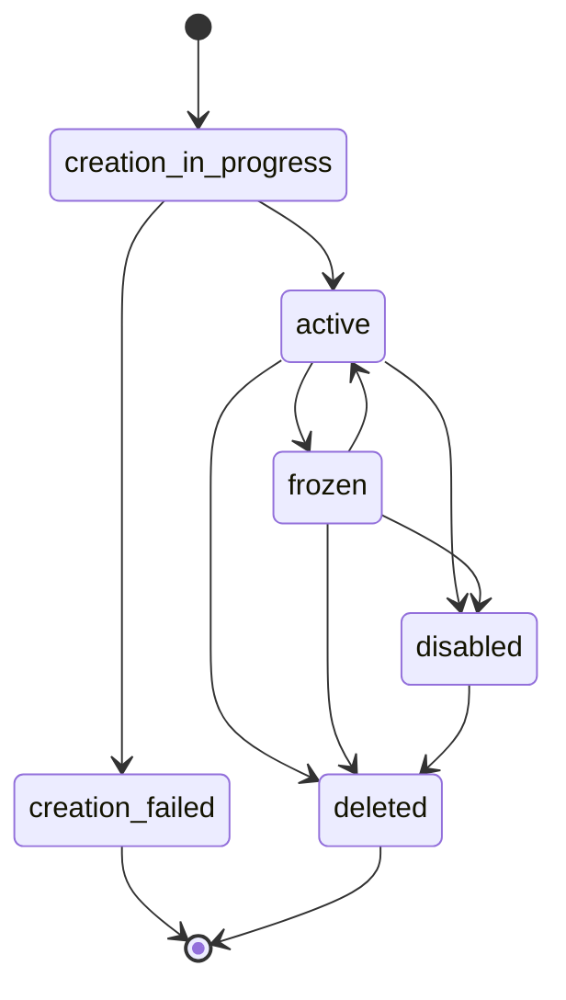
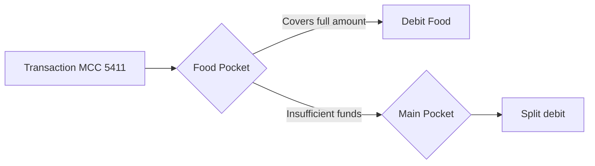

# Virtual Cards

Create and manage virtual cards for online payments using the Bloque SDK.

## Overview

Virtual cards provide a secure way to make online payments without exposing sensitive financial information. Features include:

- **Instant Creation**: Cards are created immediately
- **PCI Compliant**: Secure handling of card data
- **Multiple Cards**: Users can have multiple cards
- **Real-time Balances**: Check balances across multiple assets
- **Transaction History**: Full transaction tracking

## Creating a Virtual Card

### Basic Creation

Create a virtual card for a user:

```typescript title="create-card.ts"
import { SDK } from '@bloque/sdk';

const bloque = new SDK({
  origin: 'your-origin',
  auth: {
    type: 'apiKey',
    apiKey: process.env.BLOQUE_API_KEY!,
  },
  mode: 'production',
});

// Connect to user session
const userSession = await bloque.connect('user-alias');

// Create a virtual card
const card = await userSession.accounts.card.create({
  holderUrn: 'did:bloque:your-origin:user-alias',
  name: 'My Virtual Card',
});

console.log('Card created:', card.lastFour);
console.log('Status:', card.status);
console.log('Details URL:', card.detailsUrl);
```

### Parameters

```typescript title="types.ts"
interface CreateCardParams {
  holderUrn?: string;   // Optional user URN
  name?: string;        // Optional card name
  webhookUrl?: string;  // Optional webhook for events
  ledgerId?: string;    // Optional ledger account ID
  metadata?: Record<string, unknown>; // Custom metadata
}
```

### Response

```typescript title="types.ts"
interface CardAccount {
  urn: string;                    // Unique resource name
  id: string;                     // Card account ID
  lastFour: string;               // Last four digits
  productType: 'CREDIT' | 'DEBIT';
  status: CardStatus;
  cardType: 'VIRTUAL' | 'PHYSICAL';
  detailsUrl: string;             // PCI-compliant details URL
  ownerUrn: string;
  ledgerId: string;
  webhookUrl: string | null;
  metadata?: Record<string, unknown>;
  createdAt: string;
  updatedAt: string;
  balance?: Record<string, TokenBalance>; // Only in list responses
}
```

## Listing Cards

List all card accounts for a user with their balances:

```typescript title="list-cards.ts"
// Using connected session (recommended)
const userSession = await bloque.connect('user-alias');
const cards = await userSession.accounts.card.list();

console.log(`Found ${cards.accounts.length} card accounts`);

cards.accounts.forEach((card) => {
  console.log('\nCard:', card.metadata?.name);
  console.log('Last Four:', card.lastFour);
  console.log('Status:', card.status);

  if (card.balance) {
    Object.entries(card.balance).forEach(([token, balance]) => {
      console.log(`${token}: ${balance.current}`);
    });
  }
});

// Calculate total balance
const totalBalances: Record<string, bigint> = {};
cards.accounts.forEach(card => {
  if (card.balance) {
    Object.entries(card.balance).forEach(([token, balance]) => {
      if (!totalBalances[token]) {
        totalBalances[token] = BigInt(0);
      }
      totalBalances[token] += BigInt(balance.current);
    });
  }
});
```

## Checking Balance

Get the current balance for a specific card:

```typescript title="check-balance.ts"
const balances = await bloque.accounts.card.balance({
  urn: 'did:bloque:account:card:usr-123:crd-456',
});

Object.entries(balances).forEach(([token, balance]) => {
  console.log(`${token}:`);
  console.log(`  Current: ${balance.current}`);
  console.log(`  Pending: ${balance.pending}`);
  console.log(`  Total In: ${balance.in}`);
  console.log(`  Total Out: ${balance.out}`);

  const net = BigInt(balance.in) - BigInt(balance.out);
  console.log(`  Net: ${net.toString()}`);
});
```

## Transaction History

### Basic Listing

List transactions for a card:

```typescript title="list-transactions.ts"
const movements = await bloque.accounts.card.movements({
  urn: 'did:bloque:account:card:usr-123:crd-456',
  asset: 'DUSD/6',
});

movements.forEach((transaction) => {
  console.log(`${transaction.direction.toUpperCase()}: ${transaction.amount}`);
  console.log(`Date: ${transaction.created_at}`);

  if (transaction.details?.metadata?.merchant_name) {
    console.log(`Merchant: ${transaction.details.metadata.merchant_name}`);
  }
});
```

### With Filters and Pagination

```typescript title="filter-transactions.ts"
// Get recent incoming transactions
const recentIncoming = await bloque.accounts.card.movements({
  urn: 'did:bloque:account:card:usr-123:crd-456',
  asset: 'DUSD/6',
  limit: 50,
  direction: 'in', // Only incoming
  after: '2025-01-01T00:00:00Z',
});

// Get transactions from a specific date range
const dateRange = await bloque.accounts.card.movements({
  urn: 'did:bloque:account:card:usr-123:crd-456',
  asset: 'KSM/12',
  after: '2025-01-01T00:00:00Z',
  before: '2025-12-31T23:59:59Z',
  limit: 100,
});

// Search by reference
const byReference = await bloque.accounts.card.movements({
  urn: 'did:bloque:account:card:usr-123:crd-456',
  asset: 'DUSD/6',
  reference: '0xbff43fa587...',
});
```

### Pagination Example

```typescript title="paginate-transactions.ts"
async function getAllTransactions(cardUrn: string, asset: string) {
  const pageSize = 100;
  let allMovements = [];
  let hasMore = true;
  let lastDate: string | undefined;

  while (hasMore) {
    const movements = await bloque.accounts.card.movements({
      urn: cardUrn,
      asset,
      limit: pageSize,
      before: lastDate,
    });

    allMovements.push(...movements.data);
    console.log(`Fetched ${movements.data.length} transactions`);

    if (movements.data.length < pageSize) {
      hasMore = false;
    } else {
      lastDate = movements.data[movements.data.length - 1].created_at;
    }
  }

  return allMovements;
}
```

## Card Management

### Update Card Name

```typescript title="update-card.ts"
const updatedCard = await bloque.accounts.card.updateMetadata({
  urn: 'did:bloque:account:card:usr-123:crd-456',
  metadata: {
    name: 'My Business Card'
  }
});

console.log('Card name updated:', updatedCard.metadata?.name);
```

### Card States

Cards can be in different states:

| Status | Description | Can Transition To |
|--------|-------------|-------------------|
| `creation_in_progress` | Card is being created | `active`, `creation_failed` |
| `active` | Card is active and ready to use | `frozen`, `disabled`, `deleted` |
| `frozen` | Card is temporarily frozen | `active`, `disabled`, `deleted` |
| `disabled` | Card has been permanently disabled | `deleted` |
| `deleted` | Card has been deleted | - |
| `creation_failed` | Card creation failed | - |



## Viewing Card Details

The `detailsUrl` field provides a secure, PCI-compliant URL where users can view their full card number, CVV, and expiration date:

```typescript title="view-card-details.ts"
const card = await bloque.accounts.card.create({
  holderUrn: userUrn,
  name: 'My Card',
});

// Redirect user to view card details
console.log('View card details:', card.detailsUrl);
```

:::warning Security
Never store or log full card numbers, CVVs, or other sensitive card data. Always use the provided `detailsUrl` for displaying card details to users.
:::

## Multiple Cards

Users can have multiple cards for different purposes:

```typescript title="multiple-cards.ts"
const userUrn = 'did:bloque:your-origin:user-alias';
const userSession = await bloque.connect(userUrn);

// Personal card
const personalCard = await userSession.accounts.card.create({
  holderUrn: userUrn,
  name: 'Personal Card',
});

// Business card
const businessCard = await userSession.accounts.card.create({
  holderUrn: userUrn,
  name: 'Business Card',
});

// Travel card
const travelCard = await userSession.accounts.card.create({
  holderUrn: userUrn,
  name: 'Travel Expenses',
});

console.log('Created 3 cards:');
console.log('- Personal:', personalCard.lastFour);
console.log('- Business:', businessCard.lastFour);
console.log('- Travel:', travelCard.lastFour);
```

## Error Handling

Always handle errors appropriately:

```typescript title="error-handling.ts"
try {
  const card = await bloque.accounts.card.create({
    holderUrn: userUrn,
    name: cardName,
  });

  console.log('Card created:', card.urn);

} catch (error) {
  if (error instanceof Error) {
    console.error('Card creation failed:', error.message);

    // Handle specific errors
    if (error.message.includes('not found')) {
      // User doesn't exist
    } else if (error.message.includes('unauthorized')) {
      // API key issues
    }
  }

  throw error;
}
```

## Complete Example

```typescript title="setup-user-card.ts"
import { SDK } from '@bloque/sdk';

const bloque = new SDK({
  origin: 'your-origin',
  auth: {
    type: 'apiKey',
    apiKey: process.env.BLOQUE_API_KEY!,
  },
  mode: 'production',
});

async function setupUserCard(userUrn: string) {
  try {
    // Connect to user session
    const userSession = await bloque.connect(userUrn);

    // Create a virtual card
    const card = await userSession.accounts.card.create({
      holderUrn: userUrn,
      name: 'Main Card',
    });

    console.log('✓ Card created:', card.lastFour);

    // Check balance
    const balances = await bloque.accounts.card.balance({
      urn: card.urn,
    });

    console.log('✓ Current balances:');
    Object.entries(balances).forEach(([token, balance]) => {
      console.log(`  ${token}: ${balance.current}`);
    });

    // Get recent transactions
    const movements = await bloque.accounts.card.movements({
      urn: card.urn,
      asset: 'DUSD/6',
      limit: 10,
    });

    console.log(`✓ Found ${movements.data.length} recent transactions`);

    return { success: true, card };

  } catch (error) {
    console.error('✗ Setup failed:', error);
    throw error;
  }
}
```

## Spending Controls

Spending controls determine how card transactions are processed, including which accounts are debited, how multi-currency conversion works, and how funds are routed. You configure the spending control mode via the card's `metadata` when creating or updating the card.

### Default Spending Control

The default mode debits a single card account. It supports automatic currency conversion when the transaction currency differs from the card's asset.

```typescript title="create-card-default.ts"
const card = await userSession.accounts.card.create({
  urn: userUrn,
  name: 'Standard Card',
  metadata: {
    spending_control: 'default',      // Optional, this is the default
    default_asset: 'DUSD/6',          // Primary asset for the card
    fallback_asset: 'KSM/12',         // Used when default asset is unavailable
    currency_asset_map: {             // Maps transaction currencies to preferred assets
      USD: ['DUSD/6'],
      COP: ['COPM/2'],
      EUR: ['EURc/6'],
    },
  },
});
```

| Field | Type | Required | Description |
|-------|------|----------|-------------|
| `spending_control` | `string` | No | Set to `"default"` (or omit). |
| `default_asset` | `string` | No | Primary asset (e.g. `"DUSD/6"`). Defaults to `"DUSD/6"`. |
| `fallback_asset` | `string` | No | Fallback asset when the default is unavailable. |
| `currency_asset_map` | `object` | No | Maps ISO 4217 currency codes to an array of asset identifiers. |
| `whatsapp_notification` | `boolean` | No | Enable WhatsApp purchase notifications. Defaults to `true`. |

### Smart Spending Control

Smart spending enables **multi-pocket routing** based on Merchant Category Codes (MCC). Transactions are routed to purpose-specific sub-accounts (pockets) according to the merchant's category, and overflow is handled by lower-priority pockets.

```typescript title="create-card-smart.ts"
const card = await userSession.accounts.card.create({
  urn: userUrn,
  name: 'Smart Card',
  metadata: {
    spending_control: 'smart',
    priority_mcc: [
      'did:bloque:account:card:usr-xxx:pocket-food',
      'did:bloque:account:card:usr-xxx:pocket-transport',
      'did:bloque:account:card:usr-xxx:pocket-main',
    ],
    mcc_whitelist: {
      'did:bloque:account:card:usr-xxx:pocket-food': ['5411', '5412', '5812', '5814'],
      'did:bloque:account:card:usr-xxx:pocket-transport': ['4111', '4121', '4131'],
      // No whitelist for pocket-main = general purpose (accepts any MCC)
    },
    default_asset: 'DUSD/6',
    fallback_asset: 'KSM/12',
  },
});
```

| Field | Type | Required | Description |
|-------|------|----------|-------------|
| `spending_control` | `string` | Yes | Must be `"smart"`. |
| `priority_mcc` | `string[]` | Yes | Pocket URNs in priority order. Higher-priority pockets are debited first. |
| `mcc_whitelist` | `object` | Yes | Maps pocket URN to an array of allowed MCC codes, or a URL that returns the array. Pockets without an entry accept any MCC. |
| `default_asset` | `string` | No | Primary asset. Defaults to `"DUSD/6"`. |
| `fallback_asset` | `string` | No | Fallback asset when the default is unavailable. |
| `currency_asset_map` | `object` | No | Maps currency codes to preferred assets. |

**How routing works:**

1. The merchant's MCC is matched against each pocket's whitelist in priority order
2. Eligible pockets are debited starting from the highest priority
3. If a pocket has insufficient funds, the remainder overflows to the next eligible pocket
4. Pockets without a whitelist entry act as general-purpose catch-alls
5. Refunds are routed back to the **original pockets** that were debited, proportionally



:::tip MCC Whitelists
You can provide MCC whitelists as inline arrays or as URLs pointing to a JSON array. Using URLs makes it easy to update whitelists without modifying card metadata.
:::

## Fee Configuration

Fees can be configured at two levels using the `spending_fees` array. Each fee can be unconditional or gated by a **rule** that evaluates the transaction context at authorization time.

### Resolution Priority (Merge by Name)

Fees are **merged** across three layers by `fee_name`. Each layer can override specific fees from the layer below, and add new ones. Fees that are not redefined at a higher level are always preserved.

| Layer | Source | Description |
|-------|--------|-------------|
| Base | **Defaults** | Built-in fees (1.44% interchange + 2% FX). Always present unless explicitly overridden by name. |
| + | **Origin metadata** | `spending_fees` in the origin's metadata. Can override defaults and add new fees for all cards. |
| + | **Card metadata** | `spending_fees` in the card account's `metadata`. Can override origin/default fees and add new fees for this specific card. |

For example, if defaults define `interchange` and `fx`, the origin adds `premium`, and the card overrides `fx`:

| Fee | Default | + Origin | + Card (final) |
|-----|---------|----------|----------------|
| `interchange` | 1.44% | 1.44% | 1.44% |
| `fx` | 2.00% | 2.00% | **1.50%** (card override) |
| `premium` | — | 0.50% | 0.50% |

:::warning Base Fees Cannot Be Removed
Fees from lower layers are always preserved. A card or origin can change the `value`, `type`, `account_urn`, or `rule` of an existing fee by redefining it with the same `fee_name`, but cannot remove a fee entirely.
:::

### Defining Fees at the Origin Level

Origin-level fees apply to all cards under the origin. Configure them via the Bloque dashboard or API:

```typescript title="origin-fee-configuration.ts"
// Origin metadata (configured via Bloque dashboard or API)
{
  spending_fees: [
    {
      fee_name: 'interchange',
      account_urn: 'urn:bloque:treasury:interchange',
      type: 'percentage',
      value: 0.0144,       // 1.44% of the transaction amount
      category: 'interchange',
    },
    {
      fee_name: 'fx',
      account_urn: 'urn:bloque:treasury:fx',
      type: 'percentage',
      value: 0.02,          // 2% — drives the conversion spread
      category: 'fx',
      rule: 'fx_conversion',
    },
    {
      fee_name: 'high_ticket_fx',
      account_urn: 'urn:bloque:treasury:fx',
      type: 'percentage',
      value: 0.035,         // 3.5% — only on high-value USD settlements
      category: 'fx',
      rule: 'amount_range_usd',
      rule_params: { min: 500, max: 5000 },
    },
    {
      fee_name: 'apple_wallet',
      account_urn: 'urn:bloque:treasury:wallet',
      type: 'percentage',
      value: 0.01,          // 1% — only for Apple Wallet transactions
      rule: 'wallet',
      rule_params: { wallet_name: 'Apple' },
    },
  ],
}
```

### Defining Fees at the Card Level

Card-level fees override origin fees for a specific card. Set them in the card's `metadata.spending_fees` when creating or updating the card:

```typescript title="card-fee-override.ts"
const card = await userSession.accounts.card.create({
  urn: userUrn,
  name: 'Premium Card',
  metadata: {
    spending_fees: [
      {
        fee_name: 'interchange',
        account_urn: 'urn:bloque:treasury:interchange',
        type: 'percentage',
        value: 0.01,         // 1% — lower interchange for this card
        category: 'interchange',
      },
      {
        fee_name: 'fx',
        account_urn: 'urn:bloque:treasury:fx',
        type: 'percentage',
        value: 0.015,        // 1.5% — reduced FX spread for this card
        category: 'fx',
        rule: 'fx_conversion',
      },
    ],
  },
});
```

:::tip Per-Card Fee Overrides
Card-level fees are merged by `fee_name`. You only need to include the fees you want to override or add — all other fees from the origin and defaults are preserved automatically.
:::

### Fee Types

```typescript title="types.ts"
type SpendingFeeCategory = 'fx' | 'interchange' | 'custom';

interface SpendingFee {
  fee_name: string;           // Unique identifier (e.g., "interchange", "fx")
  account_urn: string;        // Destination account for the fee
  type: 'percentage' | 'flat';
  value: number;              // Rate (0.02 = 2%) for percentage, or amount for flat
  category?: SpendingFeeCategory; // Purpose of the fee (defaults to "custom")
  rule?: string;              // Optional: conditional rule name
  rule_params?: Record<string, unknown>; // Optional: parameters for the rule
}
```

| Fee Type | `value` meaning | Example |
|----------|----------------|---------|
| `percentage` | Fraction of the transaction amount | `0.0144` = 1.44% |
| `flat` | Fixed amount in the transaction's asset | `100000` (scaled) |

| Category | Purpose |
|----------|---------|
| `fx` | Drives the exchange rate spread in currency conversions. Multiple `fx` fees are summed. |
| `interchange` | Standard interchange fee. |
| `custom` | Default for any other fee. |

:::info FX Category and Conversion Spread
Fees with `category: "fx"` directly control the exchange rate spread applied during currency conversions. For example, an `fx` fee with `value: 0.02` results in a 2% spread (rate multiplied by 0.98). If multiple fees have `category: "fx"`, their values are summed to determine the total spread. If no `fx` category fees are configured, the default 2% spread is used.
:::

### Conditional Fee Rules

Fees without a `rule` field always apply. Fees with a rule are evaluated against the full transaction request at authorization time.

| Rule | Description | Parameters |
|------|-------------|------------|
| `fx_conversion` | Applies when the transaction required currency conversion (spending asset differs from transaction currency). | None |
| `amount_range_usd` | Applies when the USD settlement amount falls within a range. | `min?: number`, `max?: number` |
| `wallet` | Applies when the transaction was made through a specific tokenization wallet (case-insensitive partial match). | `wallet_name: string` |

:::warning Fee Calculation
Fees are calculated using BigInt arithmetic to avoid floating-point precision issues. During partial refunds (adjustments), fees are recalculated proportionally based on the refund amount relative to the original authorization.
:::

### Fee Breakdown in Events

Every successful transaction webhook includes a `fee_breakdown` object showing exactly which fees were applied:

```typescript title="types.ts"
interface FeeBreakdown {
  total_fees: string;          // Total fees as scaled BigInt string
  fees: Array<{
    fee_name: string;          // Fee identifier
    amount: string;            // Fee amount as scaled BigInt string
    rate: number;              // The rate or flat value used
  }>;
}
```

## Card Webhooks

When you provide a `webhookUrl` during card creation, your endpoint receives real-time POST notifications for every card transaction event — purchases, rejections, and adjustments (refunds).

### Webhook Payload

All card events share this structure:

```typescript title="types.ts"
interface CardWebhookPayload {
  account_urn: string;         // Card account URN
  transaction_id: string;      // Unique transaction identifier
  type: 'authorization' | 'adjustment';
  direction: 'debit' | 'credit';
  event: CardEventType;
  amount?: string;             // Scaled amount as BigInt string
  asset?: string;              // Asset used (e.g., "DUSD/6")
  local_amount?: number;       // Amount in the merchant's local currency
  local_currency?: string;     // ISO 4217 currency code (e.g., "USD", "COP")
  exchange_rate?: number;      // Conversion rate applied (1 if direct match)
  merchant?: MerchantInfo;
  medium?: TransactionMedium;
  fee_breakdown?: FeeBreakdown;
  reason?: string;             // Present on rejection events
}
```

### Event Types

| Event | Type | Direction | Description |
|-------|------|-----------|-------------|
| `purchase` | `authorization` | `debit` | Card purchase authorized and debited. |
| `rejected_insufficient_funds` | `authorization` | `debit` | Purchase rejected — insufficient balance. |
| `rejected_credit` | `authorization` | `credit` | Credit authorization rejected (not supported). |
| `rejected_currency` | `authorization` | `debit` | Purchase rejected — unsupported currency. |
| `credit_adjustment` | `adjustment` | `credit` | Refund or credit adjustment processed. |
| `debit_adjustment` | `adjustment` | `debit` | Debit adjustment processed. |

### Purchase Event Example

```json title="purchase-webhook.json"
{
  "account_urn": "did:bloque:account:card:usr-abc:crd-123",
  "transaction_id": "ctx-200kXoaEJLNzcsvNxY1pmBO7fEx",
  "type": "authorization",
  "direction": "debit",
  "event": "purchase",
  "amount": "50000000",
  "asset": "DUSD/6",
  "local_amount": 50.0,
  "local_currency": "USD",
  "exchange_rate": 1,
  "merchant": {
    "name": "AMAZON.COM",
    "mcc": "5411",
    "city": "Seattle",
    "country": "USA"
  },
  "fee_breakdown": {
    "total_fees": "720000",
    "fees": [
      { "fee_name": "interchange", "amount": "720000", "rate": 0.0144 }
    ]
  }
}
```

### Refund Event Example

```json title="refund-webhook.json"
{
  "account_urn": "did:bloque:account:card:usr-abc:crd-123",
  "transaction_id": "ctx-adj-456",
  "type": "adjustment",
  "direction": "credit",
  "event": "credit_adjustment",
  "amount": "25000000",
  "asset": "DUSD/6",
  "local_amount": 25.0,
  "local_currency": "USD",
  "exchange_rate": 1,
  "merchant": {
    "name": "AMAZON.COM",
    "mcc": "5411",
    "city": "Seattle",
    "country": "USA"
  },
  "fee_breakdown": {
    "total_fees": "360000",
    "fees": [
      { "fee_name": "interchange", "amount": "360000", "rate": 0.0144 }
    ]
  }
}
```

### Rejection Event Example

```json title="rejection-webhook.json"
{
  "account_urn": "did:bloque:account:card:usr-abc:crd-123",
  "transaction_id": "ctx-789",
  "type": "authorization",
  "direction": "debit",
  "event": "rejected_insufficient_funds",
  "required_usd": 150.0,
  "reason": "Insufficient funds"
}
```

### Handling Webhooks

```typescript title="card-webhook-handler.ts"
import express from 'express';

const app = express();

app.post('/webhooks/cards', express.json(), (req, res) => {
  const payload = req.body;

  console.log(`[${payload.transaction_id}] ${payload.event} — ${payload.type}/${payload.direction}`);

  switch (payload.event) {
    case 'purchase':
      console.log(`Purchase: ${payload.local_amount} ${payload.local_currency}`);
      console.log(`Merchant: ${payload.merchant?.name}`);
      console.log(`Fees: ${payload.fee_breakdown?.total_fees}`);
      // Update your records, notify user, etc.
      break;

    case 'credit_adjustment':
      console.log(`Refund: ${payload.local_amount} ${payload.local_currency}`);
      // Process refund in your system
      break;

    case 'debit_adjustment':
      console.log(`Debit adjustment: ${payload.local_amount} ${payload.local_currency}`);
      break;

    case 'rejected_insufficient_funds':
      console.log(`Rejected: ${payload.reason}`);
      // Notify user of failed transaction
      break;

    case 'rejected_currency':
      console.log(`Unsupported currency: ${payload.currency}`);
      break;

    case 'rejected_credit':
      console.log(`Credit rejected: ${payload.reason}`);
      break;
  }

  res.status(200).send('OK');
});
```

:::warning Idempotency
Webhook delivery uses idempotency keys based on `${type}-${transaction_id}`. Your handler should be idempotent — processing the same event twice must produce the same result.
:::

:::tip WhatsApp Notifications
Purchase events can also trigger WhatsApp notifications to the cardholder if `whatsapp_notification` is enabled in the card's metadata and the user has a phone number on file.
:::

## Best Practices

1. **User Sessions**: Always connect to a user session
2. **KYC First**: Ensure users complete KYC verification
3. **Meaningful Names**: Help users identify their cards
4. **Check Status**: Verify card status before use
5. **Security**: Never store full card numbers
6. **Error Handling**: Use try-catch blocks
7. **Test in Sandbox**: Test thoroughly before production
8. **Idempotent Webhooks**: Always handle duplicate deliveries gracefully
9. **Fee Awareness**: Include fee breakdowns in transaction receipts shown to users
10. **Smart Spending Budgets**: Use pocket-based spending controls to help users manage category budgets

## Next Steps

- [Transfers](/sdk/guide/accounts/transfers) - Transfer funds between accounts
- [Bancolombia](/sdk/guide/accounts/bancolombia) - Bancolombia integration
- [Compliance](/sdk/guide/features/compliance) - KYC verification
