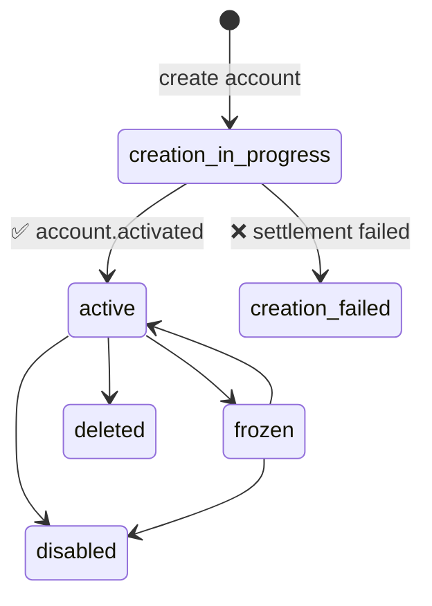

# Account Webhooks

Receive real-time notifications when account lifecycle events occur.

## Overview

When you provide a `webhookUrl` during account creation, your endpoint receives POST notifications for account lifecycle events — status changes, activation confirmations, and more. This applies to **all account types**: virtual, card, bancolombia, US, and polygon.

:::tip Medium-Specific Events
Card accounts also receive transaction-specific webhooks (purchases, refunds, rejections). See the [Card Webhooks](/sdk/guide/accounts/cards#card-webhooks) section for those events.
:::

## Setting Up Webhooks

Pass a `webhookUrl` when creating any account:

```typescript title="create-with-webhook.ts"
// Virtual account
const virtual = await session.accounts.virtual.create({
  firstName: 'John',
  lastName: 'Doe',
  webhookUrl: 'https://api.example.com/webhooks/accounts',
});

// Card account
const card = await session.accounts.card.create({
  userUrn: 'did:bloque:your-origin:user-123',
  webhookUrl: 'https://api.example.com/webhooks/accounts',
});

// Bancolombia account
const bancolombia = await session.accounts.bancolombia.create({
  webhookUrl: 'https://api.example.com/webhooks/accounts',
});
```

Your endpoint must:
- Accept `POST` requests with a JSON body
- Respond with a `2xx` status code to acknowledge receipt
- Be publicly accessible (no authentication required on your side)

## Webhook Payload

All account lifecycle events share this structure:

```typescript title="types.ts"
interface AccountWebhookPayload {
  account_urn: string;                  // Account URN
  medium: string;                       // Account type: "virtual", "card", "bancolombia", etc.
  event_type: AccountEventType;         // Event identifier
  event_data: Record<string, unknown>;  // Event-specific data
  timestamp: string;                    // ISO 8601 timestamp
}
```

## Events

### `account.activated`

Fired when an account transitions from `creation_in_progress` to `active` after on-chain settlement is confirmed. This is the signal that the account is fully operational — funds can be received and sent.

```json title="account-activated.json"
{
  "account_urn": "did:bloque:account:virtual:acc-12345",
  "medium": "virtual",
  "event_type": "account.activated",
  "event_data": {
    "status": "active",
    "settlement_status": "confirmed",
    "confirmed_at": "2025-03-15T14:30:00.000Z",
    "operations_count": 2
  },
  "timestamp": "2025-03-15T14:30:01.123Z"
}
```

| Field | Type | Description |
|-------|------|-------------|
| `event_data.status` | `string` | Always `"active"` for this event. |
| `event_data.settlement_status` | `string` | Blockchain settlement status: `"confirmed"` or `"settled"`. |
| `event_data.confirmed_at` | `string` | ISO 8601 timestamp of on-chain confirmation. |
| `event_data.operations_count` | `number` | Number of batch operations that were settled (e.g., faucet transfer + controller registration). |

## Handling Webhooks

```typescript title="account-webhook-handler.ts"
import express from 'express';

const app = express();

app.post('/webhooks/accounts', express.json(), (req, res) => {
  const { account_urn, medium, event_type, event_data, timestamp } = req.body;

  console.log(`[${timestamp}] ${event_type} for ${account_urn} (${medium})`);

  switch (event_type) {
    case 'account.activated':
      console.log(`Account is now active — settlement: ${event_data.settlement_status}`);
      // Enable account features in your application
      // Notify the user their account is ready
      activateUserAccount(account_urn);
      break;

    default:
      console.log(`Unhandled event: ${event_type}`);
  }

  // Always respond 2xx to acknowledge receipt
  res.status(200).send('OK');
});
```

### With Idempotency

Webhook delivery uses idempotency keys, but your handler should still be idempotent — processing the same event twice must produce the same result:

```typescript title="idempotent-handler.ts"
const processedEvents = new Set<string>();

app.post('/webhooks/accounts', express.json(), async (req, res) => {
  const { account_urn, event_type, timestamp } = req.body;
  const eventKey = `${account_urn}:${event_type}:${timestamp}`;

  if (processedEvents.has(eventKey)) {
    return res.status(200).send('Already processed');
  }

  // Process the event
  await handleAccountEvent(req.body);
  processedEvents.add(eventKey);

  res.status(200).send('OK');
});
```

:::warning Production Idempotency
The in-memory `Set` above is for illustration only. In production, use a persistent store (database, Redis) to track processed events across restarts and instances.
:::

## Account Lifecycle and Webhooks



The `account.activated` event fires on the `creation_in_progress → active` transition, which occurs after the on-chain batch settlement (controller registration and initial funding) is confirmed.

## Best Practices

1. **Respond quickly**: Return `200` immediately, then process asynchronously. Long-running handlers may cause delivery timeouts.
2. **Be idempotent**: The same event may be delivered more than once. Use the combination of `account_urn + event_type + timestamp` as a deduplication key.
3. **Use HTTPS**: Always use HTTPS URLs to protect webhook payloads in transit.
4. **Log everything**: Log incoming payloads for debugging and audit trails.
5. **Handle unknown events**: New event types may be added. Don't fail on unrecognized `event_type` values — log and acknowledge them.
6. **Monitor failures**: If your endpoint returns non-2xx responses repeatedly, webhook delivery may be paused. Monitor your endpoint's health.

## Next Steps

- [State Machines](/sdk/guide/features/state-machines/overview) — Full account lifecycle documentation
- [Virtual Accounts](/sdk/guide/accounts/virtual) — Virtual account creation and management
- [Virtual Cards](/sdk/guide/accounts/cards#card-webhooks) — Card-specific transaction webhooks
- [Transfers](/sdk/guide/accounts/transfers) — Transfer funds between accounts
