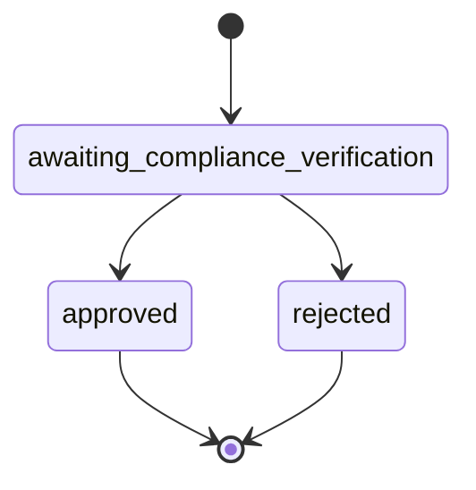

# Compliance & KYC

Learn how to implement KYC (Know Your Customer) verification using the Bloque SDK.

## Overview

The compliance module provides tools for KYC verification, allowing you to verify user identities and maintain regulatory compliance.

## Starting KYC Verification

Initialize a KYC verification process for a user:

```typescript
import { SDK } from '@bloque/sdk';
import type { KycVerificationParams } from '@bloque/sdk/compliance';

const bloque = new SDK({
  origin: 'your-origin',
  auth: {
    type: 'apiKey',
    apiKey: process.env.BLOQUE_API_KEY!,
  },
  mode: 'production',
});

const params: KycVerificationParams = {
  urn: 'did:bloque:user:123e4567',
  webhookUrl: 'https://api.example.com/webhooks/kyc', // Optional
};

const verification = await bloque.compliance.kyc.startVerification(params);

console.log('Verification URL:', verification.url);
console.log('Status:', verification.status);
```

## Parameters

### KycVerificationParams

| Field | Type | Required | Description |
|-------|------|----------|-------------|
| `urn` | `string` | Yes | URN of the user to verify |
| `webhookUrl` | `string` | No | URL for status change notifications |

## Response

### KycVerificationResponse

```typescript
interface KycVerificationResponse {
  url: string;           // URL for user to complete verification
  status: string;        // Current verification status
  completedAt: string | null;  // Completion timestamp
}
```

### Verification Status

| Status | Description | Can Transition To |
|--------|-------------|-------------------|
| `awaiting_compliance_verification` | Verification pending | `approved`, `rejected` |
| `approved` | Verification approved | - |
| `rejected` | Verification rejected | - |



## Getting Verification Status

Check the status of an existing verification:

```typescript
import type { GetKycVerificationParams } from '@bloque/sdk/compliance';

const params: GetKycVerificationParams = {
  urn: 'did:bloque:user:123e4567',
};

const status = await bloque.compliance.kyc.getVerification(params);

console.log('Status:', status.status);
console.log('Completed At:', status.completedAt);

if (status.status === 'approved') {
  console.log('User is verified!');
} else if (status.status === 'rejected') {
  console.log('Verification was rejected');
} else {
  console.log('Verification still pending');
}
```

## Webhook Integration

Set up webhooks to receive real-time updates on verification status changes:

### Setting Up Webhooks

```typescript
const verification = await bloque.compliance.kyc.startVerification({
  urn: 'did:bloque:user:123e4567',
  webhookUrl: 'https://api.example.com/webhooks/kyc',
});
```

### Webhook Payload

Your webhook endpoint will receive POST requests with the following payload:

```typescript
{
  "type": "kyc.status_changed",
  "data": {
    "urn": "did:bloque:user:123e4567",
    "status": "approved",
    "completedAt": "2024-01-15T10:30:00Z"
  }
}
```

### Webhook Handler Example

```typescript
import express from 'express';

const app = express();

app.post('/webhooks/kyc', express.json(), (req, res) => {
  const { type, data } = req.body;

  if (type === 'kyc.status_changed') {
    console.log('KYC status changed for:', data.urn);
    console.log('New status:', data.status);

    // Update your database, send notifications, etc.
    if (data.status === 'approved') {
      // Enable features for verified user
    }
  }

  res.status(200).send('OK');
});
```

## Complete Workflow

Here's a complete KYC verification workflow:

```typescript
import { SDK } from '@bloque/sdk';

const bloque = new SDK({
  origin: 'your-origin',
  auth: {
    type: 'apiKey',
    apiKey: process.env.BLOQUE_API_KEY!,
  },
  mode: 'production',
});

async function handleKYCVerification(userUrn: string) {
  try {
    // 1. Start verification
    const verification = await bloque.compliance.kyc.startVerification({
      urn: userUrn,
      webhookUrl: 'https://api.example.com/webhooks/kyc',
    });

    console.log('✓ Verification started');
    console.log('  Send user to:', verification.url);

    // 2. Store verification info in your database
    await saveVerification({
      userUrn,
      verificationUrl: verification.url,
      status: verification.status,
    });

    // 3. Redirect user to verification URL
    return verification.url;

  } catch (error) {
    console.error('Failed to start verification:', error);
    throw error;
  }
}

async function checkVerificationStatus(userUrn: string) {
  try {
    const status = await bloque.compliance.kyc.getVerification({
      urn: userUrn,
    });

    console.log('Current status:', status.status);

    if (status.status === 'approved') {
      // Update user permissions
      await updateUserPermissions(userUrn, { verified: true });
    }

    return status;

  } catch (error) {
    console.error('Failed to get status:', error);
    throw error;
  }
}
```

## User Experience Flow

1. **User initiates verification** in your application
2. **Your app calls** `startVerification()`
3. **Redirect user** to the returned verification URL
4. **User completes** KYC process on the provider's page
5. **Webhook notification** sent to your endpoint
6. **Update user status** in your system

## Security Best Practices

1. **Validate Webhooks**: Implement webhook signature validation
2. **HTTPS Only**: Use HTTPS for webhook URLs
3. **Idempotency**: Handle duplicate webhook deliveries
4. **Timeout Handling**: Set appropriate timeouts for API calls
5. **Error Logging**: Log all verification attempts and errors

## Testing

Use sandbox mode to test without real verifications:

```typescript
const bloque = new SDK({
  origin: 'your-origin',
  auth: {
    type: 'apiKey',
    apiKey: process.env.BLOQUE_API_KEY!,
  },
  mode: 'sandbox', // Test mode
});

// Test verification will return immediately
const verification = await bloque.compliance.kyc.startVerification({
  urn: 'did:bloque:user:test-123',
});
```

## Tier status

Read an identity's effective compliance level and outstanding requirements:

```typescript
const status = await user.compliance.tiers.getStatus({ urn: user.urn });

console.log(status.effectiveLevel, status.policyVersion);

// During a ToS rollout grace window the `tos` requirement stays satisfied
// until the policy cutoff — prompt acceptance even though nothing blocks yet.
const tos = status.levels
  .flatMap((level) => level.requirements)
  .find((req) => req.kind === 'tos');

if (tos?.graceUntil) {
  console.log('Ask the user to accept TOS before', tos.graceUntil);
}
```

| Field | Type | Description |
|-------|------|-------------|
| `effectiveLevel` | `number` | Highest contiguous satisfied level (`-1` if Level 0 is open). |
| `nextRecomputeAt` | `string \| null \| undefined` | Earliest ISO-8601 instant this answer can change with no further input. |
| `levels[].requirements[].graceUntil` | `string \| undefined` | On `tos` only, while a rollout `enforcement_starts_at` window is active. |

## Tier status

Read an identity's effective compliance level and outstanding requirements:

```typescript
const status = await user.compliance.tiers.getStatus({ urn: user.urn });

console.log(status.effectiveLevel, status.policyVersion);

// During a ToS rollout grace window the `tos` requirement stays satisfied
// until the policy cutoff — prompt acceptance even though nothing blocks yet.
const tos = status.levels
  .flatMap((level) => level.requirements)
  .find((req) => req.kind === 'tos');

if (tos?.graceUntil) {
  console.log('Ask the user to accept TOS before', tos.graceUntil);
}
```

| Field | Type | Description |
|-------|------|-------------|
| `effectiveLevel` | `number` | Highest contiguous satisfied level (`-1` if Level 0 is open). |
| `nextRecomputeAt` | `string \| null \| undefined` | Earliest ISO-8601 instant this answer can change with no further input. |
| `levels[].requirements[].graceUntil` | `string \| undefined` | On `tos` only, while a rollout `enforcement_starts_at` window is active. |

## Terms of Service (TOS) Gate

The TOS gate is a hosted page a user opens to accept your Terms of Service. Most of the time you never call it directly — catch a `BloqueVerificationRequiredError` with `reason === 'tos'` and open the link it gives you:

```typescript
import { BloqueVerificationRequiredError } from '@bloque/sdk';

try {
  await user.accounts.card.create({ /* ... */ });
} catch (error) {
  if (error instanceof BloqueVerificationRequiredError && error.reason === 'tos') {
    const link = await error.getVerificationLink({
      returnUrl: 'https://myapp.com/verification-complete',
    });
    // Open link.url in a browser or webview — the user accepts the TOS there.
    return { redirectTo: link?.url };
  }
  throw error;
}
```

Some Terms of Service documents also require handing the user's account to a passkey on their device (account activation) — this depends on the identity's usage country and is configured server-side, not something you opt into per call. When it applies, the hosted page runs WebAuthn automatically; you don't need to do anything extra to support it.

### Driving the gate yourself

Build your own UI around the gate with `start()` → `init()` → `accept()` instead of opening the hosted page:

```typescript
// 1. Mint a capability token + hosted URL (or just use the URL as a fallback)
const gate = await user.compliance.tosGate.start({
  returnUrl: 'https://myapp.com/verification-complete',
});

// 2. Fetch the document to render, plus whether this document requires
//    an activation step
const init = await user.compliance.tosGate.init({ token: gate.token });
console.log(init.document.content); // Rendered TOS content to display

// 3a. No activation step — just accept
await user.compliance.tosGate.accept({
  token: gate.token,
  csrfToken: init.csrfToken,
});

// 3b. With activation — mint the challenge right before the user commits
//     (it's bound to a short block-hash window, so don't fetch it at page
//     load), then run WebAuthn against it
if (init.passkeyRequired) {
  const { passkey } = await user.compliance.tosGate.challenge({ token: gate.token });

  if (passkey) {
    const credential = await navigator.credentials.create({
      publicKey: {
        challenge: base64UrlDecode(passkey.challenge),
        rp: { id: passkey.rpId },
        user: {
          id: base64UrlDecode(passkey.userId),
          name: passkey.userName,
          displayName: passkey.userName,
        },
        pubKeyCredParams: [{ type: 'public-key', alg: -7 }],
      },
    });

    const response = credential.response as AuthenticatorAttestationResponse;
    const { acceptance } = await user.compliance.tosGate.accept({
      token: gate.token,
      csrfToken: init.csrfToken,
      passkey: {
        credentialId: base64UrlEncode(credential.rawId),
        authenticatorData: base64UrlEncode(response.getAuthenticatorData()),
        clientData: base64UrlEncode(response.clientDataJSON),
        publicKey: base64UrlEncode(response.getPublicKey()!),
        context: passkey.context,
      },
    });

    console.log('Activation attempted:', acceptance.accountActivation?.attempted);
  }
}
```

Declining the passkey step is always safe — call `accept()` without `passkey`/`deviceAttestation` and the TOS acceptance still records; the account is simply left registered-but-not-activated, which is a recoverable state.

### API Reference

| Method | Returns | Description |
|--------|---------|-------------|
| `tosGate.start({ returnUrl })` | `StartGateResult` | Mints a portable capability `token` + hosted `url`. |
| `tosGate.init({ token })` | `TosGateInitResult` | Fetches the active TOS document and a single-use `csrfToken`. `passkeyRequired` is `true` only if this document requires account activation. |
| `tosGate.challenge({ token })` | `TosGateChallengeResult` | Mints the activation passkey challenge. Call right before the user commits, not at page load — the challenge is bound to a short block-hash window. Only needed when `init()`'s `passkeyRequired` is `true`. |
| `tosGate.accept({ token, csrfToken, deviceAttestation?, passkey? })` | `TosGateAcceptResult` | Records acceptance. `accountActivation` on the result is set only if you supplied `deviceAttestation`/`passkey`. |

```typescript
interface TosGateInitResult {
  document: { documentVersionId: string; versionLabel: string; contentHash: string; content: string };
  csrfToken: string;
  returnUrl: string;
  developerName?: string;
  showHome: boolean;
  accentColor?: string;
  passkeyRequired: boolean;
}

interface TosGateChallengeResult {
  passkey: {
    challenge: string;      // base64url — publicKey.challenge
    context: number;        // echo back unchanged in accept()
    expiresAtBlock: number;
    userId: string;         // base64url — publicKey.user.id
    userName: string;
    publicAddress: string;
    rpId?: string;
  } | null;
}

interface TosAcceptanceRecord {
  id: string;
  identityUrn: string;
  documentVersionId: string;
  documentVersionLabel: string;
  documentHash: string;
  acceptedAt: string;
  authAssurance: string;
  accountActivation?: {
    attempted: boolean;
    state?: string;
    publicAddress?: string;
    reason?: string;        // Non-throwing — check this instead of catching an error
  };
}
```

### Error Handling

Activation failures never throw — `accept()` still resolves and the TOS acceptance is recorded regardless. Check `acceptance.accountActivation?.attempted`/`reason` if you need to know whether the activation leg itself succeeded, and retry later via `accept()` again if it didn't.

## Next Steps

- [Accounts Guide](/sdk/guide/accounts/overview) - Create virtual cards for verified users
- [Organizations Guide](/sdk/guide/features/organizations) - Manage business accounts
