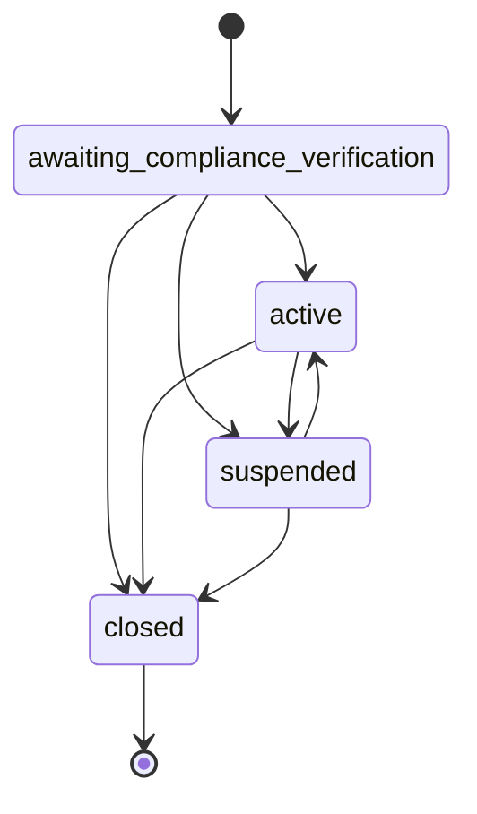

# Organizations

Learn how to create and manage organizations using the Bloque SDK.

## Overview

Organizations are the foundation of the Bloque platform. They can be either businesses or individuals and contain all the necessary profile and compliance information.

## Creating an Organization

### Business Organization

```typescript
import { SDK } from '@bloque/sdk';
import type { CreateOrgParams } from '@bloque/sdk/orgs';

const bloque = new SDK({
  origin: 'your-origin',
  auth: {
    type: 'apiKey',
    apiKey: process.env.BLOQUE_API_KEY!,
  },
  mode: 'production',
});

const params: CreateOrgParams = {
  org_type: 'business',
  profile: {
    legal_name: 'Acme Corporation',
    tax_id: '123456789',
    incorporation_date: '2020-01-01',
    business_type: 'llc',
    incorporation_country_code: 'US',
    incorporation_state: 'CA',
    address_line1: '123 Main St',
    postal_code: '94103',
    city: 'San Francisco',
  },
  metadata: {
    source: 'web_app',
    campaign: 'q1_2024',
  },
};

const organization = await bloque.orgs.create(params);
```

### Individual Organization

```typescript
const params: CreateOrgParams = {
  org_type: 'individual',
  profile: {
    legal_name: 'John Doe',
    tax_id: '123-45-6789',
    incorporation_date: '1990-05-20',
    business_type: 'sole_proprietorship',
    incorporation_country_code: 'US',
    address_line1: '456 Oak Ave',
    postal_code: '10001',
    city: 'New York',
  },
};

const organization = await bloque.orgs.create(params);
```

## Parameters

### CreateOrgParams

| Field | Type | Required | Description |
|-------|------|----------|-------------|
| `org_type` | `'business' \| 'individual'` | Yes | Type of organization |
| `profile` | `OrgProfile` | Yes | Organization profile details |
| `metadata` | `Record<string, unknown>` | No | Custom metadata |

### OrgProfile

| Field | Type | Required | Description |
|-------|------|----------|-------------|
| `legal_name` | `string` | Yes | Legal name of the organization |
| `tax_id` | `string` | Yes | Tax ID number |
| `incorporation_date` | `string` | Yes | Date of incorporation (YYYY-MM-DD) |
| `business_type` | `string` | Yes | Type of business (e.g., 'llc', 'corporation') |
| `incorporation_country_code` | `string` | Yes | Country code (ISO 3166-1 alpha-2) |
| `incorporation_state` | `string` | No | State/province |
| `address_line1` | `string` | Yes | Primary address line |
| `address_line2` | `string` | No | Secondary address line |
| `postal_code` | `string` | Yes | Postal/ZIP code |
| `city` | `string` | Yes | City |
| `logo_url` | `string` | No | Logo URL |
| `places` | `Place[]` | No | Additional locations |

## Response

### Organization

```typescript
interface Organization {
  urn: string;                           // Unique resource name
  org_type: 'business' | 'individual';   // Organization type
  profile: OrgProfile;                   // Organization profile
  metadata?: Record<string, unknown>;    // Custom metadata
  status: OrgStatus;                     // Organization status
}
```

### Organization Status

| Status | Description | Can Transition To |
|--------|-------------|-------------------|
| `awaiting_compliance_verification` | Pending compliance verification | `active`, `suspended`, `closed` |
| `active` | Organization is active and can operate | `suspended`, `closed` |
| `suspended` | Organization is temporarily suspended for compliance violation | `active`, `closed` |
| `closed` | Organization is permanently closed | - |


```mermaid
stateDiagram-v2
    [*] --> awaiting_compliance_verification
    awaiting_compliance_verification --> active
    awaiting_compliance_verification --> suspended
    awaiting_compliance_verification --> closed
    active --> suspended
    active --> closed
    suspended --> active
    suspended --> closed
    closed --> [*]
```

## Multi-location Organizations

For organizations with multiple locations, use the `places` field:

```typescript
const params: CreateOrgParams = {
  org_type: 'business',
  profile: {
    legal_name: 'Global Tech Inc',
    tax_id: '98-7654321',
    incorporation_date: '2018-03-10',
    business_type: 'corporation',
    incorporation_country_code: 'US',
    incorporation_state: 'DE',
    address_line1: '789 Corporate Blvd',
    postal_code: '19801',
    city: 'Wilmington',
    places: [
      {
        country_code: 'US',
        state: 'CA',
        address_line1: '100 Silicon Valley Dr',
        postal_code: '94025',
        city: 'Menlo Park',
        is_primary: true,
      },
      {
        country_code: 'US',
        state: 'NY',
        address_line1: '250 Broadway',
        postal_code: '10007',
        city: 'New York',
        is_primary: false,
      },
    ],
  },
};
```

## Custom Metadata

Add custom fields to track additional information:

```typescript
const params: CreateOrgParams = {
  org_type: 'business',
  profile: {
    // ... profile fields
  },
  metadata: {
    source: 'api',
    customer_id: 'cust_123',
    plan: 'enterprise',
    referral_code: 'REF2024',
  },
};
```

## Retrieving Organizations

### Get by URN

```typescript
const org = await bloque.orgs.get('bloque:org:abc123');
console.log(org.profile.legal_name, org.status);
```

### List Your Organizations

```typescript
const orgs = await bloque.orgs.list();
orgs.forEach(org => console.log(org.urn, org.profile.legal_name));
```

### Verify Slug Availability

```typescript
const result = await bloque.orgs.verifySlug('acme-corp');
console.log('Available:', result.available);
```

### Delete an Organization

```typescript
await bloque.orgs.delete('bloque:org:abc123');
```

## Members

Manage organization members.

```typescript
// List members
const members = await bloque.orgs.listMembers('bloque:org:abc123');

// Update a member's role
await bloque.orgs.members.update('bloque:member:m1', {
  role: 'admin',
});

// Remove a member
await bloque.orgs.members.remove('bloque:org:abc123', 'bloque:member:m1');
```

| Method | Parameters | Description |
|--------|-----------|-------------|
| `listMembers(orgUrn)` | `string` | List all members of the org |
| `members.update(urn, params)` | URN + `{ role }` | Update member role |
| `members.remove(orgUrn, memberUrn)` | Two URNs | Remove member from org |

## Teams

Organize members into teams with specific roles.

```typescript
// List teams
const teams = await bloque.orgs.teams.list('bloque:org:abc123');

// Update a team
await bloque.orgs.teams.update('bloque:team:t1', { name: 'Engineering' });

// List team members
const teamMembers = await bloque.orgs.teams.listMembers('bloque:team:t1');

// Update a team member's role
await bloque.orgs.teams.updateMember('bloque:team:t1', 'bloque:member:m1', {
  role: 'lead',
});

// Remove from team
await bloque.orgs.teams.removeMember('bloque:team:t1', 'bloque:member:m1');
```

| Method | Description |
|--------|-------------|
| `teams.list(orgUrn)` | List all teams in the org |
| `teams.update(teamUrn, params)` | Update team name or metadata |
| `teams.listMembers(teamUrn)` | List members of a team |
| `teams.updateMember(teamUrn, memberUrn, params)` | Update a member's team role |
| `teams.removeMember(teamUrn, memberUrn)` | Remove a member from the team |

## Invites

Send, accept, reject, and manage organization invitations.

```typescript
// Create an invite
const invite = await bloque.orgs.invites.create('bloque:org:abc123', {
  email: 'new-member@example.com',
  role: 'member',
});

// List invites
const invites = await bloque.orgs.invites.list({ orgUrn: 'bloque:org:abc123' });

// Accept an invite
await bloque.orgs.invites.accept('invite-code-123');

// Reject an invite
await bloque.orgs.invites.reject('invite-code-123', 'Not interested');

// Resend an invite
await bloque.orgs.invites.resend('invite-code-123');
```

| Method | Description |
|--------|-------------|
| `invites.create(orgUrn, params)` | Send an invite |
| `invites.get(code)` | Get invite details by code |
| `invites.list(params?)` | List invites (filter by `orgUrn`, `status`) |
| `invites.accept(code)` | Accept an invite |
| `invites.reject(code, reason?)` | Reject an invite |
| `invites.resend(code)` | Resend an invite email |

## Best Practices

1. **Validate Data**: Ensure all required fields are present before calling the API
2. **Handle Errors**: Always use try-catch blocks
3. **Store URNs**: Save the organization URN for future operations
4. **Use Metadata**: Track additional context using metadata
5. **Test in Sandbox**: Always test with `mode: 'sandbox'` first

## Next Steps

- [Compliance Guide](/sdk/guide/features/compliance) - Add KYC verification
- [Accounts Guide](/sdk/guide/accounts/overview) - Create virtual cards and accounts
