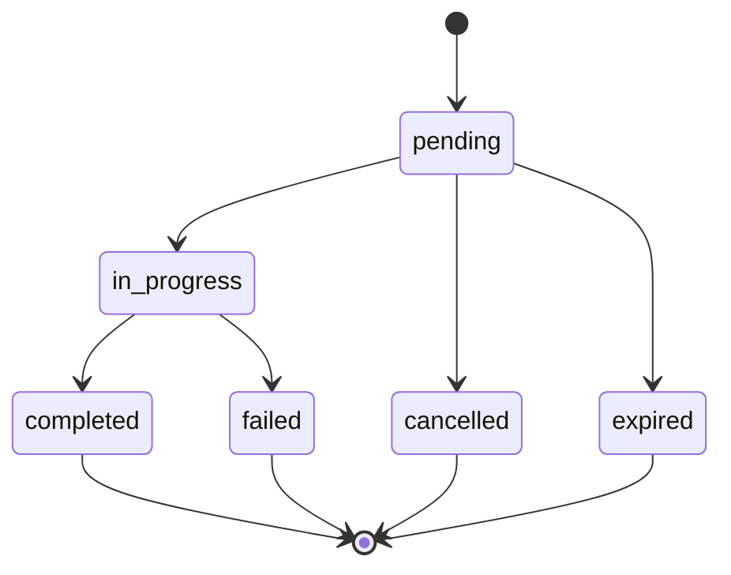
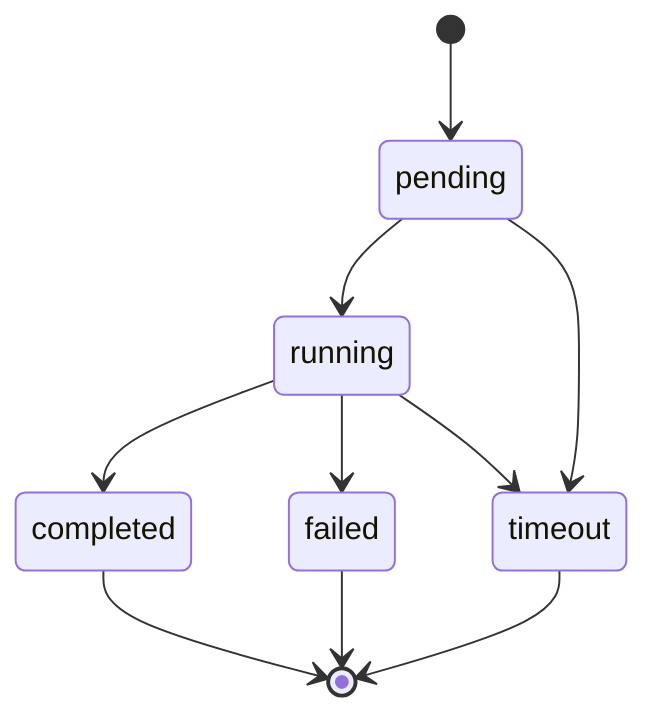

# Swap

Learn how to perform asset swaps using the Bloque SDK.

## Overview

The swap module lets you query exchange rates and perform asset swaps between supported mediums and currencies.

## Querying Exchange Rates

```typescript
import { SDK } from '@bloque/sdk';

const bloque = new SDK({
  origin: 'your-origin',
  auth: {
    type: 'apiKey',
    apiKey: process.env.BLOQUE_API_KEY!,
  },
  mode: 'production',
});

const userSession = await bloque.connect('user-alias');

const result = await userSession.swap.findRates({
  fromAsset: 'COP/2',
  toAsset: 'DUSD/6',
  fromMediums: ['bancolombia', 'pse'], // required
  toMediums: ['kusama'], // required
  amountSrc: '50000000', // 500000.00 COP (scaled by 2 decimals)
  sort: 'asc', // optional, default: 'asc'
  sortBy: 'rate', // optional, default: 'rate'
});
console.log('Swap rates result:', result);
```

## Parameters

### FindRatesParams

| Field         | Type           | Required | Description                                                        |
|-------------- |--------------- |----------|--------------------------------------------------------------------|
| `fromAsset`   | `string`       | Yes      | Source asset with precision (e.g., "COP/2")                        |
| `toAsset`     | `string`       | Yes      | Destination asset with precision (e.g., "DUSD/6")                  |
| `fromMediums` | `string[]`     | Yes      | Source payment mediums (e.g., `["bancolombia"]`)                   |
| `toMediums`   | `string[]`     | Yes      | Destination payment mediums (e.g., `["kusama"]`)                   |
| `amountSrc`   | `string`       | Optional | Source amount as bigint string (scaled by asset precision)          |
| `amountDst`   | `string`       | Optional | Destination amount as bigint string (scaled by asset precision)     |
| `sort`        | `'asc'|'desc'` | Optional | Result order (default 'asc')                                       |
| `sortBy`      | `'rate'|'at'`  | Optional | Sort field ('rate' by default)                                     |

## Response

### FindRatesResult

```typescript
interface FindRatesResult {
  rates: SwapRate[];
}
```

### SwapRate

```typescript
interface SwapRate {
  id: string;
  sig: string;
  swapSig: string;
  maker: string;
  edge: [string, string];
  fee: Fee;
  at: string;
  until: string;
  fromMediums: string[];
  toMediums: string[];
  rate: [number, number];
  ratio: number;
  fromLimits: [string, string];
  toLimits: [string, string];
  createdAt: string;
  updatedAt: string;
}
```

### Fee

```typescript
interface Fee {
  at: number;
  value: number;
  formula: string;
  components: FeeComponent[];
}
```

### FeeComponent

```typescript
interface FeeComponent {
  at: number;
  name: string;
  type: 'percentage' | 'rate' | 'fixed';
  value: number | string;
  percentage?: number;
  pair?: string;
  amount?: number;
}
```

## Complete Example Flow

```typescript
import { SwapClient } from '@bloque/swap';

const client = new SwapClient({ /* config */ });

async function queryRates() {
  const result = await client.findRates({
    fromAsset: 'COP/2',
    toAsset: 'DUSD/6',
    fromMediums: ['bancolombia'],
    toMediums: ['kusama'],
    amountSrc: '50000000',
  });

  if (result.rates.length > 0) {
    const bestRate = result.rates[0];
    console.log('Ratio:', bestRate.ratio);
    console.log('Fee:', bestRate.fee.value);
  } else {
    console.log('No rates available');
  }
}

queryRates();
```

## Best Practices

1. Validate input parameters before querying rates.
2. Use the `fromLimits` and `toLimits` fields to check allowed amounts.
3. Handle possible network or API errors gracefully.
4. Query rates right before performing a swap to avoid expiration.
5. Check the `until` field to know how long a rate is valid.

## PSE-Specific Best Practices

### Required Customer Data

For successful PSE transactions, ensure you provide the following customer data:

- **`bank_code`**: Valid bank code from `pse.banks()` list
- **`user_type`**: `0` for natural persons, `1` for legal entities
- **`customer_email`**: Valid email address for transaction notifications
- **`user_legal_id_type`**: Document type (`'CC'` for citizenship card, `'NIT'` for tax ID, `'CE'` for foreign ID)
- **`user_legal_id`**: Valid ID number matching the specified type
- **`customer_data.full_name`**: Customer's complete legal name

### Common Validation Requirements

- Ensure the legal ID number matches the selected ID type
- Use the exact bank code from the banks list (no modifications)
- Provide a valid email format for customer notifications
- Full name should match the customer's legal documentation

### Error Handling

```typescript
try {
  const result = await userSession.swap.pse.create({
    // ... parameters
  });
} catch (error) {
  if (error instanceof BloqueValidationError) {
    // Handle validation errors (missing fields, invalid IDs, etc.)
    console.error('Validation failed:', error.message);
  } else if (error instanceof BloqueAPIError) {
    // Handle API errors (bank unavailable, rate expired, etc.)
    console.error('API error:', error.message);
  }
}
```

## Next Steps

## Listing PSE Banks

You can retrieve the list of available PSE (Pagos Seguros en Línea) banks and their codes for PSE payments:

```typescript
const pseBanks = await userSession.swap.pse.banks();
for (const bank of pseBanks.banks) {
  console.log(`${bank.code}: ${bank.name}`);
}
```

### Bank Type

```typescript
interface Bank {
  code: string; // Bank code for PSE
  name: string; // Bank name
}
```

This is useful for presenting a list of banks to users when initiating PSE-based swaps or payments.

## Create PSE Swap Order

The SDK allows you to create swap orders using PSE (Pagos Seguros en Línea) as the source payment medium. The `pse.create` method combines order creation and optionally auto-executes the first instruction node to initiate the payment flow.

### Basic Usage

```typescript
// 1. Find available rates
const rates = await userSession.swap.findRates({
  fromAsset: 'COP/2',
  toAsset: 'DUSD/6',
  fromMediums: ['pse'],
  toMediums: ['kreivo'],
  amountSrc: '1000000', // 10,000.00 COP
});

// 2. Create PSE swap order
const result = await userSession.swap.pse.create({
  rateSig: rates.rates[0].sig,
  toMedium: 'kreivo',
  amountSrc: '1000000',
  depositInformation: { 
    urn: 'did:bloque:account:card:usr-xxx:crd-xxx' 
  },
  args: { 
    bank_code: '1007',
    user_type: 0,
    customer_email: 'user@example.com',
    user_legal_id_type: 'CC',
    user_legal_id: '123456789',
    customer_data: {
      full_name: 'User Name'
    }
  }, // Auto-executes PSE payment
});

// 3. Redirect user to PSE
if (result.execution?.result.how?.url) {
  window.location.href = result.execution.result.how.url;
}
```

### CreatePseOrderParams Parameters

| Field                | Type                 | Required    | Description                                                    |
|----------------------|----------------------|-------------|----------------------------------------------------------------|
| `rateSig`            | `string`             | Yes         | Rate signature obtained from findRates                         |
| `toMedium`           | `string`             | Yes         | Destination medium (e.g., 'kreivo', 'bloque')                  |
| `amountSrc`          | `string`             | Conditional | Source amount as bigint string (required if type is 'src')     |
| `amountDst`          | `string`             | Conditional | Destination amount as bigint string (required if type is 'dst')|
| `type`               | `'src' \| 'dst'`     | No          | Order type (default: 'src')                                    |
| `depositInformation` | `DepositInformation` | No          | Deposit information for fund delivery                          |
| `args`               | `PsePaymentArgs`     | No          | PSE arguments for auto-execution                               |
| `nodeId`             | `string`             | No          | Specific node ID to execute                                    |
| `metadata`           | `Record<string, unknown>` | No     | Additional metadata for the order                              |

### DepositInformation Type

```typescript
interface DepositInformation {
  urn: string; // Account URN where funds will be deposited
  // Example: "did:bloque:account:card:usr-xxx:crd-xxx"
}
```

### PsePaymentArgs Type

```typescript
interface PsePaymentArgs {
  bank_code: string;           // Bank code (from pse.banks())
  user_type?: 0 | 1;          // 0 for natural person, 1 for legal entity
  customer_email?: string;    // Customer email address
  user_legal_id_type?: string; // User legal ID type (e.g., 'CC', 'NIT', 'CE')
  user_legal_id?: string;     // User legal ID number
  customer_data?: {           // Additional customer data
    full_name: string;         // Customer's full name
  };
}
```

### CreatePseOrderResult Response

```typescript
interface CreatePseOrderResult {
  order: SwapOrder;           // Created order details
  execution?: ExecutionResult; // Auto-execution result (if args were provided)
  requestId: string;          // Request ID for tracking
}
```

### SwapOrder Type

```typescript
interface SwapOrder {
  id: string;                        // Unique order ID
  orderSig: string;                  // Order signature
  rateSig: string;                   // Rate signature used
  swapSig: string;                   // Swap signature
  taker: string;                     // Taker URN
  maker: string;                     // Maker URN
  fromAsset: string;                 // Source asset
  toAsset: string;                   // Destination asset
  fromMedium: string;                // Source medium
  toMedium: string;                  // Destination medium
  fromAmount: string;                // Source amount
  toAmount: string;                  // Destination amount
  depositInformation: DepositInformation; // Deposit information
  at: number;                        // Creation timestamp
  graphId: string;                   // Instruction graph ID
  status: SwapOrderStatus;           // Order status
  createdAt: string;                 // Creation date
  updatedAt: string;                 // Last update date
}
```

### Swap Order States

```typescript
type SwapOrderStatus = 
  | 'pending'      // Order created, waiting for execution
  | 'in_progress'  // Order in process of execution
  | 'completed'    // Order completed successfully
  | 'failed'       // Order failed
  | 'cancelled'    // Order cancelled
  | 'expired';     // Order expired
```

### ExecutionResult Type

```typescript
interface ExecutionResult {
  nodeId: string;   // Executed node ID
  result: {
    status: ExecutionStatus;  // Execution status
    args?: unknown[];     // Additional arguments
    description?: string; // Result description
    how?: ExecutionHow;   // Instructions for completing this step
  };
}
```

### Execution States

```typescript
type ExecutionStatus = 
  | 'pending'    // Node pending execution
  | 'running'   // Node executing
  | 'completed'  // Node completed successfully
  | 'failed'     // Node failed during execution
  | 'timeout';   // Node timed out
```

## States and Transitions

### Order States

| State | Description | Can Transition To |
|--------|-------------|-------------------|
| `pending` | Order created, waiting for execution | `in_progress`, `cancelled`, `expired` |
| `in_progress` | Order in process of execution | `completed`, `failed` |
| `completed` | Order completed successfully | - |
| `failed` | Order failed | - |
| `cancelled` | Order cancelled manually | - |
| `expired` | Order expired by time | - |



### Node Execution States

| State | Description | Can Transition To |
|--------|-------------|-------------------|
| `pending` | Node pending execution | `running`, `timeout` |
| `running` | Node actively executing | `completed`, `failed`, `timeout` |
| `completed` | Node completed successfully | - |
| `failed` | Node failed during execution | - |
| `timeout` | Node timed out | - |



### Complete PSE Flow Example

```typescript
import { SDK } from '@bloque/sdk';

const bloque = new SDK({
  origin: 'your-origin',
  auth: {
    type: 'apiKey',
    apiKey: process.env.BLOQUE_API_KEY!,
  },
  mode: 'production',
});

async function performPSESwap() {
  const userSession = await bloque.connect('user-alias');

  // 1. Get list of banks
  const { banks } = await userSession.swap.pse.banks();
  console.log('Available banks:', banks);

  // 2. Find available rates
  const rates = await userSession.swap.findRates({
    fromAsset: 'COP/2',
    toAsset: 'DUSD/6',
    fromMediums: ['pse'],
    toMediums: ['kreivo'],
    amountSrc: '50000000', // 500,000.00 COP
  });

  if (rates.rates.length === 0) {
    console.log('No rates available');
    return;
  }

  // 3. Create PSE swap order with auto-execution
  const result = await userSession.swap.pse.create({
    rateSig: rates.rates[0].sig,
    toMedium: 'kreivo',
    amountSrc: '50000000',
    depositInformation: {
      urn: 'did:bloque:account:card:usr-2p9pn77R6mWHqH96KYKQBylasRD:crd-38uPtyeKTjalMK1jysgoAql3l9n',
    },
    args: {
      bank_code: banks[0].code, // Bank selected by user
      user_type: 0, // Natural person
      customer_email: 'user@example.com',
      user_legal_id_type: 'CC',
      user_legal_id: '123456789',
      customer_data: {
        full_name: 'John Doe',
      },
    },
  });

  console.log('Order created:', result.order.id);
  console.log('Status:', result.order.status);
  console.log('Graph ID:', result.order.graphId);

  // 4. Redirect user to PSE if redirect URL is available
  if (result.execution?.result.how?.url) {
    console.log('Redirecting to PSE...');
    window.location.href = result.execution.result.how.url;
  }
}

performPSESwap();
```

## Create Bancolombia Swap Order

The SDK allows you to create swap orders using Kusama as the source payment medium and Bancolombia as the destination. The `bancolombia.create` method combines order creation and optionally auto-executes the first instruction node to initiate the swap flow.

### Basic Usage

```typescript
// 1. Find available rates
const rates = await userSession.swap.findRates({
  fromAsset: 'KSM/12',
  toAsset: 'COP/2',
  fromMediums: ['kusama'],
  toMediums: ['bancolombia'],
  amountSrc: '100000000', // 100.000000000 KSM (12 decimals)
});

// 2. Create Bancolombia swap order
const result = await userSession.swap.bancolombia.create({
  rateSig: rates.rates[0].sig,
  amountSrc: '100000000',
  depositInformation: {
    bankAccountType: 'savings',
    bankAccountNumber: '5740088718',
    bankAccountHolderName: 'jon Doe',
    bankAccountHolderIdentificationType: 'CC',
    bankAccountHolderIdentificationValue: '123456789'
  },
  args: {
    accountUrn: 'did:bloque:card:1231231'
  }
});

// 3. Check order status
console.log('Order created:', result.order.id);
console.log('Status:', result.order.status);
```

### CreateBancolombiaOrderParams Parameters

| Field                     | Type                              | Required    | Description                                                    |
|---------------------------|-----------------------------------|-------------|----------------------------------------------------------------|
| `rateSig`                 | `string`                          | Yes         | Rate signature obtained from findRates                         |
| `amountSrc`               | `string`                          | Conditional | Source amount as bigint string (required if type is 'src')     |
| `amountDst`               | `string`                          | Conditional | Destination amount as bigint string (required if type is 'dst')|
| `type`                    | `'src' \| 'dst'`                  | No          | Order type (default: 'src')                                    |
| `depositInformation`      | `BancolombiaDepositInformation`   | Yes         | Bancolombia bank account information for fund delivery          |
| `args`                    | `KusamaAccountArgs`               | No          | Kusama account arguments for auto-execution                     |
| `nodeId`                  | `string`                          | No          | Specific node ID to execute                                    |
| `metadata`                | `Record<string, unknown>`          | No          | Additional metadata for the order                              |

### BancolombiaDepositInformation Type

```typescript
interface BancolombiaDepositInformation {
  bankAccountType: 'savings' | 'checking';                    // Account type
  bankAccountNumber: string;                                   // Account number
  bankAccountHolderName: string;                                // Account holder name
  bankAccountHolderIdentificationType: 'CC' | 'CE' | 'NIT' | 'PP'; // ID type
  bankAccountHolderIdentificationValue: string;                // ID number
}
```

### KusamaAccountArgs Type

```typescript
interface KusamaAccountArgs {
  accountUrn: string;  // Kusama account URN for source funds
}
```

### Complete Bancolombia Flow Example

```typescript
import { SDK } from '@bloque/sdk';

const bloque = new SDK({
  origin: 'your-origin',
  auth: {
    type: 'apiKey',
    apiKey: process.env.BLOQUE_API_KEY!,
  },
  mode: 'production',
});

async function performBancolombiaSwap() {
  const userSession = await bloque.connect('user-alias');

  // 1. Find available rates for Kusama to Bancolombia
  const rates = await userSession.swap.findRates({
    fromAsset: 'KSM/12',
    toAsset: 'COP/2',
    fromMediums: ['kusama'],
    toMediums: ['bancolombia'],
    amountSrc: '100000000', // 100.000000000 KSM
  });

  if (rates.rates.length === 0) {
    console.log('No rates available');
    return;
  }

  // 2. Create Bancolombia swap order with bank details
  const result = await userSession.swap.bancolombia.create({
    rateSig: rates.rates[0].sig,
    amountSrc: '100000000',
    type: 'src', // Specify exact KSM amount to pay
    depositInformation: {
      bankAccountType: 'savings',
      bankAccountNumber: '5740088718',
      bankAccountHolderName: 'jon Doe',
      bankAccountHolderIdentificationType: 'CC',
      bankAccountHolderIdentificationValue: '123456789'
    },
    args: {
      accountUrn: 'did:bloque:card:1231231' // Source Kusama account
    }
  });

  console.log('Order created:', result.order.id);
  console.log('Status:', result.order.status);
  console.log('From Amount:', result.order.fromAmount);
  console.log('To Amount:', result.order.toAmount);
  console.log('Graph ID:', result.order.graphId);

  // 3. Monitor order execution (if applicable)
  if (result.execution) {
    console.log('Execution started:', result.execution.nodeId);
  }
}

performBancolombiaSwap();
```

### Order Types

- **`src` (default)**: User specifies the exact amount to pay. Destination amount is calculated from the rate.
  - Example: "I want to pay exactly 10,000 COP, give me whatever DUSD that gets me"
- **`dst`**: User specifies the exact amount to receive. Source amount is calculated from the rate.
  - Example: "I want to receive exactly 5 DUSD, I'll pay whatever COP is needed"

- [Accounts Guide](/sdk/guide/accounts/overview) - Create and manage accounts for swap operations
- [Organizations Guide](/sdk/guide/features/organizations) - Manage entities that can perform swaps
