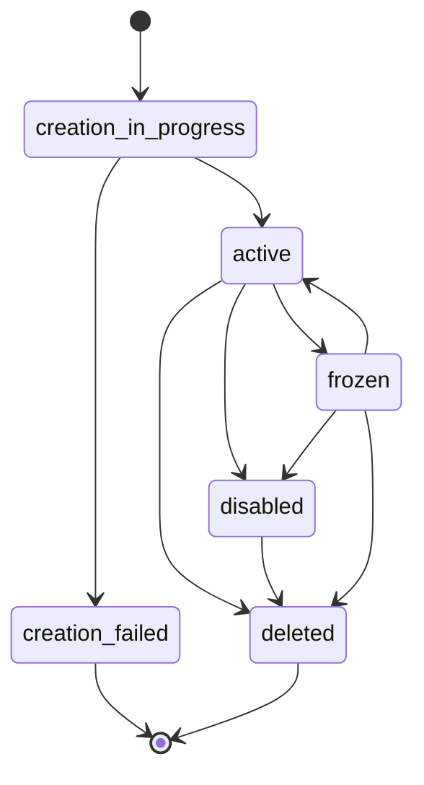

# Tarjetas Virtuales

Crea y gestiona tarjetas virtuales para pagos en línea usando el SDK de Bloque.

## Descripción General

Las tarjetas virtuales proporcionan una forma segura de realizar pagos en línea sin exponer información financiera sensible. Las características incluyen:

- **Creación Instantánea**: Las tarjetas se crean inmediatamente
- **Cumplimiento PCI**: Manejo seguro de datos de tarjetas
- **Múltiples Tarjetas**: Los usuarios pueden tener múltiples tarjetas
- **Saldos en Tiempo Real**: Consulta saldos en múltiples activos
- **Historial de Transacciones**: Seguimiento completo de transacciones

## Creando una Tarjeta Virtual

### Creación Básica

Crea una tarjeta virtual para un usuario:

```typescript title="create-card.ts"
import { SDK } from '@bloque/sdk';

const bloque = new SDK({
  origin: 'tu-origen',
  auth: {
    type: 'apiKey',
    apiKey: process.env.BLOQUE_API_KEY!,
  },
  mode: 'production',
});

// Conectar a la sesión del usuario
const userSession = await bloque.connect('user-alias');

// Crear una tarjeta virtual
const card = await userSession.accounts.card.create({
  holderUrn: 'did:bloque:tu-origen:user-alias',
  name: 'Mi Tarjeta Virtual',
});

console.log('Tarjeta creada:', card.lastFour);
console.log('Estado:', card.status);
console.log('URL de detalles:', card.detailsUrl);
```

### Parámetros

```typescript title="tipos.ts"
interface CreateCardParams {
  holderUrn?: string;   // Optional user URN
  name?: string;        // Optional card name
  webhookUrl?: string;  // Optional webhook for events
  ledgerId?: string;    // Optional ledger account ID
  metadata?: Record<string, unknown>; // Custom metadata
}
```

### Respuesta

```typescript title="tipos.ts"
interface CardAccount {
  urn: string;                    // Unique resource name
  id: string;                     // Card account ID
  lastFour: string;               // Last four digits
  productType: 'CREDIT' | 'DEBIT';
  status: CardStatus;
  cardType: 'VIRTUAL' | 'PHYSICAL';
  detailsUrl: string;             // PCI-compliant details URL
  ownerUrn: string;
  ledgerId: string;
  webhookUrl: string | null;
  metadata?: Record<string, unknown>;
  createdAt: string;
  updatedAt: string;
  balance?: Record<string, TokenBalance>; // Only in list responses
}
```

## Listando Tarjetas

Lista todas las cuentas de tarjetas de un usuario con sus saldos:

```typescript title="list-cards.ts"
// Usando sesión conectada (recomendado)
const userSession = await bloque.connect('user-alias');
const cards = await userSession.accounts.card.list();

console.log(`Se encontraron ${cards.accounts.length} cuentas de tarjeta`);

cards.accounts.forEach((card) => {
  console.log('\nCard:', card.metadata?.name);
  console.log('Últimos cuatro:', card.lastFour);
  console.log('Estado:', card.status);

  if (card.balance) {
    Object.entries(card.balance).forEach(([token, balance]) => {
      console.log(`${token}: ${balance.current}`);
    });
  }
});

// Calcular balance total
const totalBalances: Record<string, bigint> = {};
cards.accounts.forEach(card => {
  if (card.balance) {
    Object.entries(card.balance).forEach(([token, balance]) => {
      if (!totalBalances[token]) {
        totalBalances[token] = BigInt(0);
      }
      totalBalances[token] += BigInt(balance.current);
    });
  }
});
```

## Consultando Saldo

Obtiene el saldo actual de una tarjeta específica:

```typescript title="check-balance.ts"
const balances = await bloque.accounts.card.balance({
  urn: 'did:bloque:account:card:usr-123:crd-456',
});

Object.entries(balances).forEach(([token, balance]) => {
  console.log(`${token}:`);
  console.log(`  Actual: ${balance.current}`);
  console.log(`  Pendiente: ${balance.pending}`);
  console.log(`  Total Entradas: ${balance.in}`);
  console.log(`  Total Salidas: ${balance.out}`);

  const net = BigInt(balance.in) - BigInt(balance.out);
  console.log(`  Neto: ${net.toString()}`);
});
```

## Historial de Transacciones

### Listado Básico

Lista las transacciones de una tarjeta:

```typescript title="list-transactions.ts"
const movements = await bloque.accounts.card.movements({
  urn: 'did:bloque:account:card:usr-123:crd-456',
  asset: 'DUSD/6',
});

movements.forEach((transaction) => {
  console.log(`${transaction.direction.toUpperCase()}: ${transaction.amount}`);
  console.log(`Date: ${transaction.created_at}`);

  if (transaction.details?.metadata?.merchant_name) {
    console.log(`Merchant: ${transaction.details.metadata.merchant_name}`);
  }
});
```

### Con Filtros y Paginación

```typescript title="filter-transactions.ts"
// Get recent incoming transactions
const recentIncoming = await bloque.accounts.card.movements({
  urn: 'did:bloque:account:card:usr-123:crd-456',
  asset: 'DUSD/6',
  limit: 50,
  direction: 'in', // Only incoming
  after: '2025-01-01T00:00:00Z',
});

// Get transactions from a specific date range
const dateRange = await bloque.accounts.card.movements({
  urn: 'did:bloque:account:card:usr-123:crd-456',
  asset: 'KSM/12',
  after: '2025-01-01T00:00:00Z',
  before: '2025-12-31T23:59:59Z',
  limit: 100,
});

// Buscar por referencia
const byReference = await bloque.accounts.card.movements({
  urn: 'did:bloque:account:card:usr-123:crd-456',
  asset: 'DUSD/6',
  reference: '0xbff43fa587...',
});
```

### Ejemplo de Paginación

```typescript title="paginate-transactions.ts"
async function getAllTransactions(cardUrn: string, asset: string) {
  const pageSize = 100;
  let allMovements = [];
  let hasMore = true;
  let lastDate: string | undefined;

  while (hasMore) {
    const movements = await bloque.accounts.card.movements({
      urn: cardUrn,
      asset,
      limit: pageSize,
      before: lastDate,
    });

    allMovements.push(...movements.data);
    console.log(`Se obtuvieron ${movements.data.length} transacciones`);

    if (movements.data.length < pageSize) {
      hasMore = false;
    } else {
      lastDate = movements.data[movements.data.length - 1].created_at;
    }
  }

  return allMovements;
}
```

## Gestión de Tarjetas

### Actualizar Nombre de Tarjeta

```typescript title="update-card.ts"
const updatedCard = await bloque.accounts.card.updateMetadata({
  urn: 'did:bloque:account:card:usr-123:crd-456',
  metadata: {
    name: 'Mi Tarjeta de Negocio'
  }
});

console.log('Card name updated:', updatedCard.metadata?.name);
```

### Estados de Tarjeta

Las tarjetas pueden estar en diferentes estados:

| Estado | Descripción | Puede Transicionar A |
|--------|-------------|-------------------|
| `creation_in_progress` | La tarjeta se está creando | `active`, `creation_failed` |
| `creation_failed` | Falló la creación de la tarjeta | - |
| `active` | La tarjeta está activa y lista para usar | `disabled`, `frozen`, `deleted` |
| `disabled` | La tarjeta ha sido deshabilitada | `deleted` |
| `frozen` | La tarjeta está temporalmente congelada | `active`, `disabled`, `deleted` |
| `deleted` | La tarjeta ha sido eliminada | - |



## Visualizando Detalles de Tarjeta

El campo `detailsUrl` proporciona una URL segura y compatible con PCI donde los usuarios pueden ver su número de tarjeta completo, CVV y fecha de expiración:

```typescript title="view-card-details.ts"
const card = await bloque.accounts.card.create({
  holderUrn: userUrn,
  name: 'Mi Tarjeta',
});

// Redirect user to view card details
console.log('Ver detalles de tarjeta:', card.detailsUrl);
```

:::warning Seguridad
Nunca almacenes o registres números de tarjeta completos, CVVs u otros datos sensibles de tarjetas. Usa siempre el `detailsUrl` proporcionado para mostrar los detalles de la tarjeta a los usuarios.
:::

## Múltiples Tarjetas

Los usuarios pueden tener múltiples tarjetas para diferentes propósitos:

```typescript title="multiple-cards.ts"
const userUrn = 'did:bloque:tu-origen:user-alias';
const userSession = await bloque.connect(userUrn);

// Tarjeta personal
const personalCard = await userSession.accounts.card.create({
  holderUrn: userUrn,
  name: 'Tarjeta Personal',
});

// Tarjeta de negocio
const businessCard = await userSession.accounts.card.create({
  holderUrn: userUrn,
  name: 'Tarjeta Negocio',
});

// Tarjeta de viaje
const travelCard = await userSession.accounts.card.create({
  holderUrn: userUrn,
  name: 'Gastos de Viaje',
});

console.log('Se crearon 3 tarjetas:');
console.log('- Personal:', personalCard.lastFour);
console.log('- Business:', businessCard.lastFour);
console.log('- Travel:', travelCard.lastFour);
```

## Manejo de Errores

Siempre maneja los errores apropiadamente:

```typescript title="error-handling.ts"
try {
  const card = await bloque.accounts.card.create({
    holderUrn: userUrn,
    name: cardName,
  });

  console.log('Tarjeta creada:', card.urn);

} catch (error) {
  if (error instanceof Error) {
    console.error('Card creation failed:', error.message);

    // Handle specific errors
    if (error.message.includes('not found')) {
      // User doesn't exist
    } else if (error.message.includes('unauthorized')) {
      // API key issues
    }
  }

  throw error;
}
```

## Ejemplo Completo

```typescript title="setup-user-card.ts"
import { SDK } from '@bloque/sdk';

const bloque = new SDK({
  origin: 'tu-origen',
  auth: {
    type: 'apiKey',
    apiKey: process.env.BLOQUE_API_KEY!,
  },
  mode: 'production',
});

async function setupUserCard(userUrn: string) {
  try {
    // Conectar a la sesión del usuario
    const userSession = await bloque.connect(userUrn);

    // Crear una tarjeta virtual
    const card = await userSession.accounts.card.create({
      holderUrn: userUrn,
      name: 'Tarjeta Principal',
    });

    console.log('✓ Tarjeta creada:', card.lastFour);

    // Consultar saldo
    const balances = await bloque.accounts.card.balance({
      urn: card.urn,
    });

    console.log('✓ Saldos actuales:');
    Object.entries(balances).forEach(([token, balance]) => {
      console.log(`  ${token}: ${balance.current}`);
    });

    // Get recent transactions
    const movements = await bloque.accounts.card.movements({
      urn: card.urn,
      asset: 'DUSD/6',
      limit: 10,
    });

    console.log(`✓ Se encontraron ${movements.data.length} transacciones recientes`);

    return { success: true, card };

  } catch (error) {
    console.error('✗ Setup failed:', error);
    throw error;
  }
}
```

## Mejores Prácticas

1. **Sesiones de Usuario**: Siempre conéctate a una sesión de usuario
2. **KYC Primero**: Asegúrate de que los usuarios completen la verificación KYC
3. **Nombres Significativos**: Ayuda a los usuarios a identificar sus tarjetas
4. **Verificar Estado**: Verifica el estado de la tarjeta antes de usarla
5. **Seguridad**: Nunca almacenes números de tarjeta completos
6. **Manejo de Errores**: Usa bloques try-catch
7. **Probar en Sandbox**: Prueba exhaustivamente antes de producción

## Próximos Pasos

- [Transferencias](/sdk/guide/accounts/transfers) - Transferir fondos entre cuentas
- [Bancolombia](/sdk/guide/accounts/bancolombia) - Integración con Bancolombia
- [Cumplimiento](/sdk/guide/features/compliance) - Verificación KYC
