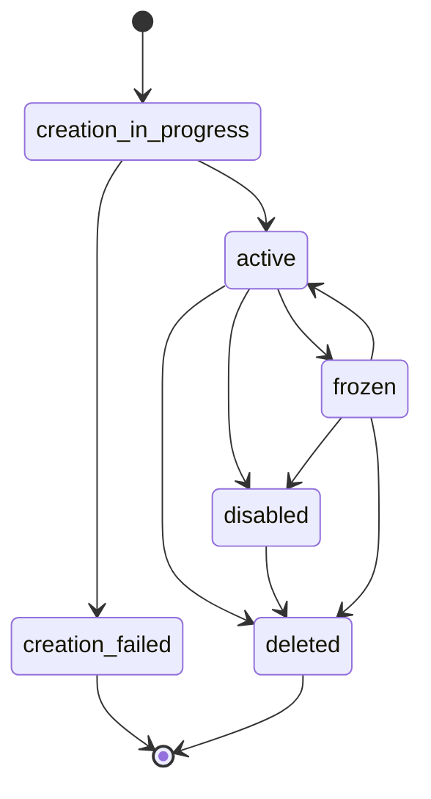
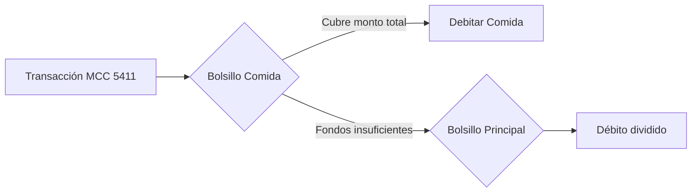

# Tarjetas Virtuales

Crea y gestiona tarjetas virtuales para pagos en línea usando el SDK de Bloque.

## Descripción General

Las tarjetas virtuales proporcionan una forma segura de realizar pagos en línea sin exponer información financiera sensible. Las características incluyen:

- **Creación Instantánea**: Las tarjetas se crean inmediatamente
- **Cumplimiento PCI**: Manejo seguro de datos de tarjetas
- **Múltiples Tarjetas**: Los usuarios pueden tener múltiples tarjetas
- **Saldos en Tiempo Real**: Consulta saldos en múltiples activos
- **Historial de Transacciones**: Seguimiento completo de transacciones

## Creando una Tarjeta Virtual

### Creación Básica

Crea una tarjeta virtual para un usuario:

```typescript title="create-card.ts"
import { SDK } from '@bloque/sdk';

const bloque = new SDK({
  origin: 'your-origin',
  auth: {
    type: 'apiKey',
    apiKey: process.env.BLOQUE_API_KEY!,
  },
  mode: 'production',
});

// Connect to user session
const userSession = await bloque.connect('user-alias');

// Create a virtual card
const card = await userSession.accounts.card.create({
  urn: 'did:bloque:your-origin:user-alias',
  name: 'My Virtual Card',
});

console.log('Card created:', card.lastFour);
console.log('Status:', card.status);
console.log('Details URL:', card.detailsUrl);
```

### Parámetros

```typescript title="types.ts"
interface CreateCardParams {
  urn: string;          // User URN
  name?: string;        // Optional card name
  webhookUrl?: string;  // Optional webhook for events
  ledgerId?: string;    // Optional ledger account ID
  metadata?: Record<string, unknown>; // Custom metadata
}
```

### Respuesta

```typescript title="types.ts"
interface CardAccount {
  urn: string;                    // Unique resource name
  id: string;                     // Card account ID
  lastFour: string;               // Last four digits
  productType: 'CREDIT' | 'DEBIT';
  status: CardStatus;
  cardType: 'VIRTUAL' | 'PHYSICAL';
  detailsUrl: string;             // PCI-compliant details URL
  ownerUrn: string;
  ledgerId: string;
  webhookUrl: string | null;
  metadata?: Record<string, unknown>;
  createdAt: string;
  updatedAt: string;
  balance?: Record<string, TokenBalance>; // Only in list responses
}
```

## Listando Tarjetas

Lista todas las cuentas de tarjetas de un usuario con sus saldos:

```typescript title="list-cards.ts"
// Using connected session (recommended)
const userSession = await bloque.connect('user-alias');
const cards = await userSession.accounts.card.list();

console.log(`Found ${cards.length} card accounts`);

cards.forEach((card) => {
  console.log('\nCard:', card.metadata?.name);
  console.log('Last Four:', card.lastFour);
  console.log('Status:', card.status);

  if (card.balance) {
    Object.entries(card.balance).forEach(([token, balance]) => {
      console.log(`${token}: ${balance.current}`);
    });
  }
});

// Calculate total balance
const totalBalances: Record<string, bigint> = {};
cards.forEach(card => {
  if (card.balance) {
    Object.entries(card.balance).forEach(([token, balance]) => {
      if (!totalBalances[token]) {
        totalBalances[token] = BigInt(0);
      }
      totalBalances[token] += BigInt(balance.current);
    });
  }
});
```

## Consultando Saldo

Obtiene el saldo actual de una tarjeta específica:

```typescript title="check-balance.ts"
const balances = await bloque.accounts.card.balance({
  urn: 'did:bloque:account:card:usr-123:crd-456',
});

Object.entries(balances).forEach(([token, balance]) => {
  console.log(`${token}:`);
  console.log(`  Current: ${balance.current}`);
  console.log(`  Pending: ${balance.pending}`);
  console.log(`  Total In: ${balance.in}`);
  console.log(`  Total Out: ${balance.out}`);

  const net = BigInt(balance.in) - BigInt(balance.out);
  console.log(`  Net: ${net.toString()}`);
});
```

## Historial de Transacciones

### Listado Básico

Lista las transacciones de una tarjeta:

```typescript title="list-transactions.ts"
const movements = await bloque.accounts.card.movements({
  urn: 'did:bloque:account:card:usr-123:crd-456',
  asset: 'DUSD/6',
});

movements.forEach((transaction) => {
  console.log(`${transaction.direction.toUpperCase()}: ${transaction.amount}`);
  console.log(`Date: ${transaction.created_at}`);

  if (transaction.details?.metadata?.merchant_name) {
    console.log(`Merchant: ${transaction.details.metadata.merchant_name}`);
  }
});
```

### Con Filtros y Paginación

```typescript title="filter-transactions.ts"
// Get recent incoming transactions
const recentIncoming = await bloque.accounts.card.movements({
  urn: 'did:bloque:account:card:usr-123:crd-456',
  asset: 'DUSD/6',
  limit: 50,
  direction: 'in', // Only incoming
  after: '2025-01-01T00:00:00Z',
});

// Get transactions from a specific date range
const dateRange = await bloque.accounts.card.movements({
  urn: 'did:bloque:account:card:usr-123:crd-456',
  asset: 'KSM/12',
  after: '2025-01-01T00:00:00Z',
  before: '2025-12-31T23:59:59Z',
  limit: 100,
});

// Search by reference
const byReference = await bloque.accounts.card.movements({
  urn: 'did:bloque:account:card:usr-123:crd-456',
  asset: 'DUSD/6',
  reference: '0xbff43fa587...',
});
```

### Ejemplo de Paginación

```typescript title="paginate-transactions.ts"
async function getAllTransactions(cardUrn: string, asset: string) {
  const pageSize = 100;
  let allMovements = [];
  let hasMore = true;
  let lastDate: string | undefined;

  while (hasMore) {
    const movements = await bloque.accounts.card.movements({
      urn: cardUrn,
      asset,
      limit: pageSize,
      before: lastDate,
    });

    allMovements.push(...movements);
    console.log(`Fetched ${movements.length} transactions`);

    if (movements.length < pageSize) {
      hasMore = false;
    } else {
      lastDate = movements[movements.length - 1].created_at;
    }
  }

  return allMovements;
}
```

## Gestión de Tarjetas

### Actualizar Nombre de Tarjeta

```typescript title="update-card.ts"
const updatedCard = await bloque.accounts.card.updateMetadata({
  urn: 'did:bloque:account:card:usr-123:crd-456',
  metadata: {
    name: 'My Business Card'
  }
});

console.log('Card name updated:', updatedCard.metadata?.name);
```

### Estados de Tarjeta

Las tarjetas pueden estar en diferentes estados:

| Estado | Descripción | Puede Transicionar A |
|--------|-------------|-------------------|
| `creation_in_progress` | La tarjeta se está creando | `active`, `creation_failed` |
| `creation_failed` | Falló la creación de la tarjeta | - |
| `active` | La tarjeta está activa y lista para usar | `disabled`, `frozen`, `deleted` |
| `disabled` | La tarjeta ha sido deshabilitada | `deleted` |
| `frozen` | La tarjeta está temporalmente congelada | `active`, `disabled`, `deleted` |
| `deleted` | La tarjeta ha sido eliminada | - |


```mermaid
stateDiagram-v2
    [*] --> creation_in_progress
    creation_in_progress --> active
    creation_in_progress --> creation_failed
    active --> disabled
    active --> frozen
    active --> deleted
    disabled --> deleted
    frozen --> active
    frozen --> disabled
    frozen --> deleted
    creation_failed --> [*]
    deleted --> [*]
```

## Visualizando Detalles de Tarjeta

El campo `detailsUrl` proporciona una URL segura y compatible con PCI donde los usuarios pueden ver su número de tarjeta completo, CVV y fecha de expiración:

```typescript title="view-card-details.ts"
const card = await bloque.accounts.card.create({
  urn: userUrn,
  name: 'My Card',
});

// Redirect user to view card details
console.log('View card details:', card.detailsUrl);
```

:::warning Seguridad
Nunca almacenes o registres números de tarjeta completos, CVVs u otros datos sensibles de tarjetas. Usa siempre el `detailsUrl` proporcionado para mostrar los detalles de la tarjeta a los usuarios.
:::

## Múltiples Tarjetas

Los usuarios pueden tener múltiples tarjetas para diferentes propósitos:

```typescript title="multiple-cards.ts"
const userUrn = 'did:bloque:your-origin:user-alias';
const userSession = await bloque.connect(userUrn);

// Personal card
const personalCard = await userSession.accounts.card.create({
  urn: userUrn,
  name: 'Personal Card',
});

// Business card
const businessCard = await userSession.accounts.card.create({
  urn: userUrn,
  name: 'Business Card',
});

// Travel card
const travelCard = await userSession.accounts.card.create({
  urn: userUrn,
  name: 'Travel Expenses',
});

console.log('Created 3 cards:');
console.log('- Personal:', personalCard.lastFour);
console.log('- Business:', businessCard.lastFour);
console.log('- Travel:', travelCard.lastFour);
```

## Manejo de Errores

Siempre maneja los errores apropiadamente:

```typescript title="error-handling.ts"
try {
  const card = await bloque.accounts.card.create({
    urn: userUrn,
    name: cardName,
  });

  console.log('Card created:', card.urn);

} catch (error) {
  if (error instanceof Error) {
    console.error('Card creation failed:', error.message);

    // Handle specific errors
    if (error.message.includes('not found')) {
      // User doesn't exist
    } else if (error.message.includes('unauthorized')) {
      // API key issues
    }
  }

  throw error;
}
```

## Ejemplo Completo

```typescript title="setup-user-card.ts"
import { SDK } from '@bloque/sdk';

const bloque = new SDK({
  origin: 'your-origin',
  auth: {
    type: 'apiKey',
    apiKey: process.env.BLOQUE_API_KEY!,
  },
  mode: 'production',
});

async function setupUserCard(userUrn: string) {
  try {
    // Connect to user session
    const userSession = await bloque.connect(userUrn);

    // Create a virtual card
    const card = await userSession.accounts.card.create({
      urn: userUrn,
      name: 'Main Card',
    });

    console.log('✓ Card created:', card.lastFour);

    // Check balance
    const balances = await bloque.accounts.card.balance({
      urn: card.urn,
    });

    console.log('✓ Current balances:');
    Object.entries(balances).forEach(([token, balance]) => {
      console.log(`  ${token}: ${balance.current}`);
    });

    // Get recent transactions
    const movements = await bloque.accounts.card.movements({
      urn: card.urn,
      asset: 'DUSD/6',
      limit: 10,
    });

    console.log(`✓ Found ${movements.length} recent transactions`);

    return { success: true, card };

  } catch (error) {
    console.error('✗ Setup failed:', error);
    throw error;
  }
}
```

## Controles de Gasto

Los controles de gasto determinan cómo se procesan las transacciones con tarjeta, incluyendo qué cuentas se debitan, cómo funciona la conversión multicurrency y cómo se enrutan los fondos. El modo de control de gasto se configura a través del `metadata` de la tarjeta al crearla o actualizarla.

### Control de Gasto por Defecto

El modo por defecto debita una única cuenta de tarjeta. Soporta conversión automática de moneda cuando la moneda de la transacción difiere del activo de la tarjeta.

```typescript title="create-card-default.ts"
const card = await userSession.accounts.card.create({
  urn: userUrn,
  name: 'Tarjeta Estándar',
  metadata: {
    spending_control: 'default',      // Opcional, es el valor por defecto
    default_asset: 'DUSD/6',          // Activo principal de la tarjeta
    fallback_asset: 'KSM/12',         // Usado cuando el activo principal no está disponible
    currency_asset_map: {             // Mapea monedas de transacción a activos preferidos
      USD: ['DUSD/6'],
      COP: ['COPM/2'],
      EUR: ['EURc/6'],
    },
  },
});
```

| Campo | Tipo | Requerido | Descripción |
|-------|------|-----------|-------------|
| `spending_control` | `string` | No | Establecer como `"default"` (o no incluir). |
| `default_asset` | `string` | No | Activo principal (ej. `"DUSD/6"`). Por defecto `"DUSD/6"`. |
| `fallback_asset` | `string` | No | Activo de respaldo cuando el principal no está disponible. |
| `currency_asset_map` | `object` | No | Mapea códigos de moneda ISO 4217 a un array de identificadores de activos. |
| `whatsapp_notification` | `boolean` | No | Habilitar notificaciones de compra por WhatsApp. Por defecto `true`. |

### Control de Gasto Inteligente

El gasto inteligente permite **enrutamiento multi-bolsillo** basado en Códigos de Categoría de Comercio (MCC). Las transacciones se enrutan a subcuentas (bolsillos) según la categoría del comercio, y el excedente se maneja por bolsillos de menor prioridad.

```typescript title="create-card-smart.ts"
const card = await userSession.accounts.card.create({
  urn: userUrn,
  name: 'Tarjeta Inteligente',
  metadata: {
    spending_control: 'smart',
    priority_mcc: [
      'did:bloque:account:card:usr-xxx:pocket-food',
      'did:bloque:account:card:usr-xxx:pocket-transport',
      'did:bloque:account:card:usr-xxx:pocket-main',
    ],
    mcc_whitelist: {
      'did:bloque:account:card:usr-xxx:pocket-food': ['5411', '5412', '5812', '5814'],
      'did:bloque:account:card:usr-xxx:pocket-transport': ['4111', '4121', '4131'],
      // Sin whitelist para pocket-main = propósito general (acepta cualquier MCC)
    },
    default_asset: 'DUSD/6',
    fallback_asset: 'KSM/12',
  },
});
```

| Campo | Tipo | Requerido | Descripción |
|-------|------|-----------|-------------|
| `spending_control` | `string` | Sí | Debe ser `"smart"`. |
| `priority_mcc` | `string[]` | Sí | URNs de bolsillos en orden de prioridad. Los bolsillos de mayor prioridad se debitan primero. |
| `mcc_whitelist` | `object` | Sí | Mapea URN de bolsillo a un array de códigos MCC permitidos, o una URL que retorna el array. Bolsillos sin entrada aceptan cualquier MCC. |
| `default_asset` | `string` | No | Activo principal. Por defecto `"DUSD/6"`. |
| `fallback_asset` | `string` | No | Activo de respaldo cuando el principal no está disponible. |
| `currency_asset_map` | `object` | No | Mapea códigos de moneda a activos preferidos. |

**Cómo funciona el enrutamiento:**

1. El MCC del comercio se compara contra la whitelist de cada bolsillo en orden de prioridad
2. Los bolsillos elegibles se debitan comenzando por el de mayor prioridad
3. Si un bolsillo tiene fondos insuficientes, el remanente pasa al siguiente bolsillo elegible
4. Los bolsillos sin entrada en la whitelist actúan como receptores generales
5. Los reembolsos se enrutan de vuelta a los **bolsillos originales** que fueron debitados, proporcionalmente


```mermaid
flowchart LR
    TX[Transacción MCC 5411] --> P1{Bolsillo Comida}
    P1 -->|Cubre monto total| Done[Debitar Comida]
    P1 -->|Fondos insuficientes| P2{Bolsillo Principal}
    P2 --> Split[Débito dividido]
```

:::tip Whitelists de MCC
Puedes proporcionar las whitelists de MCC como arrays en línea o como URLs que apuntan a un array JSON. Usar URLs facilita actualizar las whitelists sin modificar el metadata de la tarjeta.
:::

## Configuración de Comisiones

Las comisiones se pueden configurar en dos niveles usando el array `spending_fees`. Cada comisión puede ser incondicional o estar controlada por una **regla** que evalúa el contexto de la transacción al momento de la autorización.

### Prioridad de Resolución (Fusión por Nombre)

Las comisiones se **fusionan** a través de tres capas por `fee_name`. Cada capa puede sobreescribir comisiones específicas de la capa inferior y agregar nuevas. Las comisiones que no se redefinen en una capa superior siempre se preservan.

| Capa | Fuente | Descripción |
|------|--------|-------------|
| Base | **Por defecto** | Comisiones predeterminadas (1.44% interchange + 2% FX). Siempre presentes a menos que se sobreescriban explícitamente por nombre. |
| + | **Metadata de origen** | `spending_fees` en el metadata del origen. Puede sobreescribir valores por defecto y agregar nuevas comisiones para todas las tarjetas. |
| + | **Metadata de tarjeta** | `spending_fees` en el `metadata` de la cuenta de tarjeta. Puede sobreescribir comisiones del origen/defecto y agregar nuevas para esta tarjeta específica. |

Por ejemplo, si los valores por defecto definen `interchange` y `fx`, el origen agrega `premium`, y la tarjeta sobreescribe `fx`:

| Comisión | Por defecto | + Origen | + Tarjeta (final) |
|----------|-------------|----------|-------------------|
| `interchange` | 1.44% | 1.44% | 1.44% |
| `fx` | 2.00% | 2.00% | **1.50%** (sobreescrito por tarjeta) |
| `premium` | — | 0.50% | 0.50% |

:::warning Las Comisiones Base No Se Pueden Eliminar
Las comisiones de capas inferiores siempre se preservan. Una tarjeta u origen puede cambiar el `value`, `type`, `account_urn` o `rule` de una comisión existente redefiniéndola con el mismo `fee_name`, pero no puede eliminar una comisión por completo.
:::

### Definiendo Comisiones a Nivel de Origen

Las comisiones a nivel de origen aplican a todas las tarjetas bajo el origen. Se configuran a través del panel de Bloque o la API:

```typescript title="origin-fee-configuration.ts"
// Metadata del origen (configurado via panel de Bloque o API)
{
  spending_fees: [
    {
      fee_name: 'interchange',
      account_urn: 'urn:bloque:treasury:interchange',
      type: 'percentage',
      value: 0.0144,       // 1.44% del monto de la transacción
    },
    {
      fee_name: 'fx',
      account_urn: 'urn:bloque:treasury:fx',
      type: 'percentage',
      value: 0.02,          // 2% — solo en transacciones con conversión de moneda
      rule: 'fx_conversion',
    },
    {
      fee_name: 'high_ticket_fx',
      account_urn: 'urn:bloque:treasury:fx',
      type: 'percentage',
      value: 0.035,         // 3.5% — solo en liquidaciones USD de alto valor
      rule: 'amount_range_usd',
      rule_params: { min: 500, max: 5000 },
    },
    {
      fee_name: 'apple_wallet',
      account_urn: 'urn:bloque:treasury:wallet',
      type: 'percentage',
      value: 0.01,          // 1% — solo para transacciones de Apple Wallet
      rule: 'wallet',
      rule_params: { wallet_name: 'Apple' },
    },
  ],
}
```

### Definiendo Comisiones a Nivel de Tarjeta

Las comisiones a nivel de tarjeta sobreescriben las del origen para una tarjeta específica. Se configuran en `metadata.spending_fees` al crear o actualizar la tarjeta:

```typescript title="card-fee-override.ts"
const card = await userSession.accounts.card.create({
  urn: userUrn,
  name: 'Tarjeta Premium',
  metadata: {
    spending_fees: [
      {
        fee_name: 'interchange',
        account_urn: 'urn:bloque:treasury:interchange',
        type: 'percentage',
        value: 0.01,         // 1% — interchange reducido para esta tarjeta
      },
      {
        fee_name: 'fx',
        account_urn: 'urn:bloque:treasury:fx',
        type: 'percentage',
        value: 0.015,        // 1.5% — comisión FX reducida
        rule: 'fx_conversion',
      },
    ],
  },
});
```

:::tip Sobreescritura de Comisiones por Tarjeta
Las comisiones a nivel de tarjeta se fusionan por `fee_name`. Solo necesitas incluir las comisiones que deseas sobreescribir o agregar — todas las demás comisiones del origen y los valores por defecto se preservan automáticamente.
:::

### Tipos de Comisión

```typescript title="types.ts"
interface SpendingFee {
  fee_name: string;           // Identificador único (ej. "interchange", "fx")
  account_urn: string;        // Cuenta destino para la comisión
  type: 'percentage' | 'flat';
  value: number;              // Tasa (0.02 = 2%) para porcentaje, o monto para fijo
  rule?: string;              // Opcional: nombre de regla condicional
  rule_params?: Record<string, unknown>; // Opcional: parámetros para la regla
}
```

| Tipo de Comisión | Significado de `value` | Ejemplo |
|-----------------|------------------------|---------|
| `percentage` | Fracción del monto de la transacción | `0.0144` = 1.44% |
| `flat` | Monto fijo en el activo de la transacción | `100000` (escalado) |

### Reglas Condicionales de Comisiones

Las comisiones sin campo `rule` siempre se aplican. Las comisiones con una regla se evalúan contra la solicitud completa de la transacción al momento de la autorización.

| Regla | Descripción | Parámetros |
|-------|-------------|------------|
| `fx_conversion` | Se aplica cuando la transacción requirió conversión de moneda (el activo de gasto difiere de la moneda de la transacción). | Ninguno |
| `amount_range_usd` | Se aplica cuando el monto de liquidación en USD cae dentro de un rango. | `min?: number`, `max?: number` |
| `wallet` | Se aplica cuando la transacción se realizó a través de una billetera de tokenización específica (coincidencia parcial, sin distinción de mayúsculas). | `wallet_name: string` |

:::warning Cálculo de Comisiones
Las comisiones se calculan usando aritmética BigInt para evitar problemas de precisión de punto flotante. Durante reembolsos parciales (ajustes), las comisiones se recalculan proporcionalmente basándose en el monto del reembolso relativo a la autorización original.
:::

### Desglose de Comisiones en Eventos

Cada webhook de transacción exitosa incluye un objeto `fee_breakdown` mostrando exactamente qué comisiones se aplicaron:

```typescript title="types.ts"
interface FeeBreakdown {
  total_fees: string;          // Comisiones totales como string BigInt escalado
  fees: Array<{
    fee_name: string;          // Identificador de la comisión
    amount: string;            // Monto de la comisión como string BigInt escalado
    rate: number;              // La tasa o valor fijo utilizado
  }>;
}
```

## Webhooks de Tarjeta

Cuando proporcionas un `webhookUrl` durante la creación de la tarjeta, tu endpoint recibe notificaciones POST en tiempo real para cada evento de transacción — compras, rechazos y ajustes (reembolsos).

### Payload del Webhook

Todos los eventos de tarjeta comparten esta estructura:

```typescript title="types.ts"
interface CardWebhookPayload {
  account_urn: string;         // URN de la cuenta de tarjeta
  transaction_id: string;      // Identificador único de la transacción
  type: 'authorization' | 'adjustment';
  direction: 'debit' | 'credit';
  event: CardEventType;
  amount?: string;             // Monto escalado como string BigInt
  asset?: string;              // Activo utilizado (ej. "DUSD/6")
  local_amount?: number;       // Monto en la moneda local del comercio
  local_currency?: string;     // Código de moneda ISO 4217 (ej. "USD", "COP")
  exchange_rate?: number;      // Tasa de conversión aplicada (1 si coincidencia directa)
  merchant?: MerchantInfo;
  medium?: TransactionMedium;
  fee_breakdown?: FeeBreakdown;
  reason?: string;             // Presente en eventos de rechazo
}
```

### Tipos de Evento

| Evento | Tipo | Dirección | Descripción |
|--------|------|-----------|-------------|
| `purchase` | `authorization` | `debit` | Compra con tarjeta autorizada y debitada. |
| `rejected_insufficient_funds` | `authorization` | `debit` | Compra rechazada — saldo insuficiente. |
| `rejected_credit` | `authorization` | `credit` | Autorización de crédito rechazada (no soportada). |
| `rejected_currency` | `authorization` | `debit` | Compra rechazada — moneda no soportada. |
| `credit_adjustment` | `adjustment` | `credit` | Reembolso o ajuste de crédito procesado. |
| `debit_adjustment` | `adjustment` | `debit` | Ajuste de débito procesado. |

### Ejemplo de Evento de Compra

```json title="purchase-webhook.json"
{
  "account_urn": "did:bloque:account:card:usr-abc:crd-123",
  "transaction_id": "ctx-200kXoaEJLNzcsvNxY1pmBO7fEx",
  "type": "authorization",
  "direction": "debit",
  "event": "purchase",
  "amount": "50000000",
  "asset": "DUSD/6",
  "local_amount": 50.0,
  "local_currency": "USD",
  "exchange_rate": 1,
  "merchant": {
    "name": "AMAZON.COM",
    "mcc": "5411",
    "city": "Seattle",
    "country": "USA"
  },
  "fee_breakdown": {
    "total_fees": "720000",
    "fees": [
      { "fee_name": "interchange", "amount": "720000", "rate": 0.0144 }
    ]
  }
}
```

### Ejemplo de Evento de Reembolso

```json title="refund-webhook.json"
{
  "account_urn": "did:bloque:account:card:usr-abc:crd-123",
  "transaction_id": "ctx-adj-456",
  "type": "adjustment",
  "direction": "credit",
  "event": "credit_adjustment",
  "amount": "25000000",
  "asset": "DUSD/6",
  "local_amount": 25.0,
  "local_currency": "USD",
  "exchange_rate": 1,
  "merchant": {
    "name": "AMAZON.COM",
    "mcc": "5411",
    "city": "Seattle",
    "country": "USA"
  },
  "fee_breakdown": {
    "total_fees": "360000",
    "fees": [
      { "fee_name": "interchange", "amount": "360000", "rate": 0.0144 }
    ]
  }
}
```

### Ejemplo de Evento de Rechazo

```json title="rejection-webhook.json"
{
  "account_urn": "did:bloque:account:card:usr-abc:crd-123",
  "transaction_id": "ctx-789",
  "type": "authorization",
  "direction": "debit",
  "event": "rejected_insufficient_funds",
  "required_usd": 150.0,
  "reason": "Insufficient funds"
}
```

### Manejando Webhooks

```typescript title="card-webhook-handler.ts"
import express from 'express';

const app = express();

app.post('/webhooks/cards', express.json(), (req, res) => {
  const payload = req.body;

  console.log(`[${payload.transaction_id}] ${payload.event} — ${payload.type}/${payload.direction}`);

  switch (payload.event) {
    case 'purchase':
      console.log(`Compra: ${payload.local_amount} ${payload.local_currency}`);
      console.log(`Comercio: ${payload.merchant?.name}`);
      console.log(`Comisiones: ${payload.fee_breakdown?.total_fees}`);
      // Actualizar registros, notificar usuario, etc.
      break;

    case 'credit_adjustment':
      console.log(`Reembolso: ${payload.local_amount} ${payload.local_currency}`);
      // Procesar reembolso en tu sistema
      break;

    case 'debit_adjustment':
      console.log(`Ajuste de débito: ${payload.local_amount} ${payload.local_currency}`);
      break;

    case 'rejected_insufficient_funds':
      console.log(`Rechazado: ${payload.reason}`);
      // Notificar al usuario de la transacción fallida
      break;

    case 'rejected_currency':
      console.log(`Moneda no soportada: ${payload.currency}`);
      break;

    case 'rejected_credit':
      console.log(`Crédito rechazado: ${payload.reason}`);
      break;
  }

  res.status(200).send('OK');
});
```

:::warning Idempotencia
La entrega de webhooks usa claves de idempotencia basadas en `${type}-${transaction_id}`. Tu handler debe ser idempotente — procesar el mismo evento dos veces debe producir el mismo resultado.
:::

:::tip Notificaciones de WhatsApp
Los eventos de compra también pueden activar notificaciones de WhatsApp al titular de la tarjeta si `whatsapp_notification` está habilitado en el metadata de la tarjeta y el usuario tiene un número de teléfono registrado.
:::

## Mejores Prácticas

1. **Sesiones de Usuario**: Siempre conéctate a una sesión de usuario
2. **KYC Primero**: Asegúrate de que los usuarios completen la verificación KYC
3. **Nombres Significativos**: Ayuda a los usuarios a identificar sus tarjetas
4. **Verificar Estado**: Verifica el estado de la tarjeta antes de usarla
5. **Seguridad**: Nunca almacenes números de tarjeta completos
6. **Manejo de Errores**: Usa bloques try-catch
7. **Probar en Sandbox**: Prueba exhaustivamente antes de producción
8. **Webhooks Idempotentes**: Siempre maneja entregas duplicadas de forma segura
9. **Transparencia de Comisiones**: Incluye el desglose de comisiones en los recibos mostrados a los usuarios
10. **Presupuestos Inteligentes**: Usa controles de gasto por bolsillo para ayudar a los usuarios a gestionar presupuestos por categoría

## Próximos Pasos

- [Transferencias](/sdk/guide/accounts/transfers) - Transferir fondos entre cuentas
- [Bancolombia](/sdk/guide/accounts/bancolombia) - Integración con Bancolombia
- [Cumplimiento](/sdk/guide/features/compliance) - Verificación KYC
