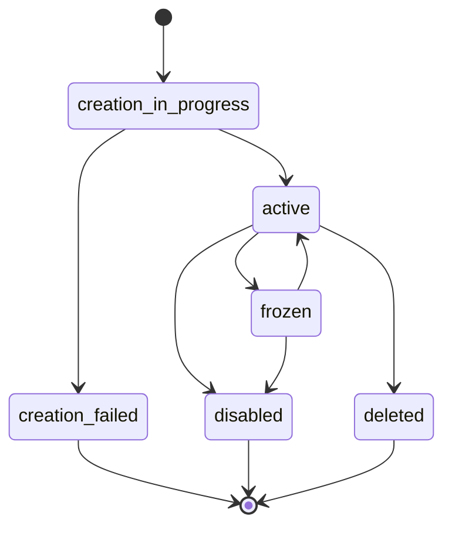

# Polygon

Crea y gestiona billeteras de criptomonedas en la red Polygon usando el SDK de Bloque.

## Descripción General

Las cuentas Polygon son billeteras de criptomonedas en la red Polygon (MATIC). Son ideales para:

- **Transacciones Web3**: Interacción con contratos inteligentes y dApps
- **Baja Fricción**: Comisiones de transacción mínimas comparadas con Ethereum
- **Creación Automática**: Generación instantánea de billeteras sin entrada adicional
- **Escalabilidad**: Alta velocidad de transacción y bajo costo

## Crear una Cuenta Polygon

### Creación Básica

Crea una billetera Polygon sin necesidad de proporcionar datos adicionales:

```typescript title="crear-cuenta-polygon.ts"
import { SDK } from '@bloque/sdk';

const bloque = new SDK({
  origin: 'tu-origen',
  auth: {
    type: 'apiKey',
    apiKey: process.env.BLOQUE_API_KEY!,
  },
  mode: 'production',
});

// Conectar a sesión de usuario
const session = await bloque.connect('did:bloque:tu-origen:alias-usuario');

// Crear una cuenta Polygon
const account = await session.accounts.polygon.create({
  metadata: {
    proposito: 'transacciones-web3',
    proyecto: 'mi-dapp',
  },
});

console.log('Cuenta creada:', account.urn);
console.log('Dirección:', account.address);
console.log('Red:', account.network); // "polygon"
console.log('Estado:', account.status);
```

### Parámetros

```typescript title="tipos.ts"
interface CreatePolygonAccountParams {
  ledgerId?: string;       // Opcional: ID de cuenta ledger (se crea automáticamente si no se proporciona)
  webhookUrl?: string;     // Opcional: Webhook para eventos de la cuenta
  metadata?: Record<string, string>; // Opcional: Metadata personalizada (debe ser strings)
}
```

:::info Creación Automática
Las cuentas Polygon no requieren ninguna entrada de datos. La dirección de la billetera y las claves se generan automáticamente de forma segura.
:::

### Respuesta

```typescript title="tipos.ts"
interface PolygonAccount {
  urn: string;              // Nombre de recurso único
  id: string;               // ID de la cuenta
  address: string;          // Dirección de la billetera Polygon (0x...)
  network: string;          // Red blockchain ("polygon")
  status: AccountStatus;    // Estado de la cuenta
  ownerUrn: string;         // URN del propietario
  ledgerId: string;         // ID de cuenta ledger
  webhookUrl: string | null;
  metadata?: Record<string, string>;
  createdAt: string;        // Timestamp ISO 8601
  updatedAt: string;        // Timestamp ISO 8601
}

type AccountStatus =
  | 'creation_in_progress'  // Creación en progreso
  | 'active'               // Activa
  | 'disabled'             // Deshabilitada
  | 'frozen'               // Congelada
  | 'deleted'              // Eliminada
  | 'creation_failed';     // Creación fallida
```

## Gestionar Cuentas Polygon

### Actualizar Metadata

Actualiza metadata personalizada en una cuenta Polygon:

```typescript title="actualizar-metadata.ts"
const actualizada = await session.accounts.polygon.updateMetadata({
  urn: 'did:bloque:account:polygon:0x05B10c9B6241b73fc8c906fB7979eFc7764AB731',
  metadata: {
    actualizado_por: 'admin',
    proyecto: 'dapp-v2',
    entorno: 'produccion',
  },
});

console.log('Metadata actualizada:', actualizada.metadata);
```

:::warning Restricciones de Metadata
El campo `source` está reservado y no puede modificarse a través de actualizaciones de metadata.
Todos los valores de metadata deben ser strings.
:::

### Estados de Cuenta

Gestiona el estado de las cuentas Polygon:

```typescript title="gestionar-estado.ts"
const accountUrn = 'did:bloque:account:polygon:0x05B10c9B6241b73fc8c906fB7979eFc7764AB731';

// Activar cuenta
const activada = await session.accounts.polygon.activate(accountUrn);
console.log('Estado:', activada.status); // 'active'

// Congelar cuenta (suspender temporalmente)
const congelada = await session.accounts.polygon.freeze(accountUrn);
console.log('Estado:', congelada.status); // 'frozen'

// Deshabilitar cuenta (permanentemente)
const deshabilitada = await session.accounts.polygon.disable(accountUrn);
console.log('Estado:', deshabilitada.status); // 'disabled'
```

#### Estados Disponibles

| Estado | Descripción | Puede Transicionar A |
|--------|-------------|---------------------|
| `creation_in_progress` | La cuenta se está creando | `active`, `creation_failed` |
| `active` | Cuenta activa y usable | `frozen`, `disabled`, `deleted` |
| `frozen` | Cuenta temporalmente suspendida | `active`, `disabled` |
| `disabled` | Cuenta permanentemente deshabilitada | - |
| `deleted` | Cuenta eliminada | - |
| `creation_failed` | Creación de cuenta fallida | - |



## Casos de Uso

### Integración con dApp

```typescript title="integracion-dapp.ts"
import { SDK } from '@bloque/sdk';

const bloque = new SDK({
  origin: 'mi-dapp',
  auth: { type: 'apiKey', apiKey: process.env.BLOQUE_API_KEY! },
  mode: 'production',
});

async function crearBilleteraUsuario(userAlias: string) {
  const session = await bloque.connect(`did:bloque:mi-dapp:${userAlias}`);

  // Crear billetera Polygon para el usuario
  const wallet = await session.accounts.polygon.create({
    metadata: {
      user_id: userAlias,
      created_via: 'dapp-onboarding',
      purpose: 'nft-marketplace',
    },
  });

  console.log('Billetera creada para usuario:', userAlias);
  console.log('Dirección:', wallet.address);
  console.log('URN:', wallet.urn);

  return wallet;
}

// Usar en tu aplicación
const userWallet = await crearBilleteraUsuario('usuario123');
```

### Gestión de Múltiples Billeteras

```typescript title="multiples-billeteras.ts"
import { SDK } from '@bloque/sdk';

const bloque = new SDK({
  origin: 'mi-app',
  auth: { type: 'apiKey', apiKey: process.env.BLOQUE_API_KEY! },
  mode: 'production',
});

async function configurarBilleterasProyecto() {
  const session = await bloque.connect('did:bloque:mi-app:admin');

  // Crear billetera para tesorería
  const treasury = await session.accounts.polygon.create({
    metadata: {
      type: 'treasury',
      purpose: 'project-funds',
    },
  });

  // Crear billetera para recompensas
  const rewards = await session.accounts.polygon.create({
    metadata: {
      type: 'rewards',
      purpose: 'user-incentives',
    },
  });

  // Crear billetera para staking
  const staking = await session.accounts.polygon.create({
    metadata: {
      type: 'staking',
      purpose: 'token-staking',
    },
  });

  return { treasury, rewards, staking };
}

const wallets = await configurarBilleterasProyecto();
console.log('Billeteras del proyecto configuradas:', {
  treasury: wallets.treasury.address,
  rewards: wallets.rewards.address,
  staking: wallets.staking.address,
});
```

## Manejo de Errores

Maneja los errores apropiadamente al trabajar con cuentas Polygon:

```typescript title="manejo-errores.ts"
import {
  BloqueValidationError,
  BloqueNotFoundError,
  BloqueAuthenticationError,
} from '@bloque/sdk';

try {
  const account = await session.accounts.polygon.create({
    metadata: {
      proyecto: 'mi-dapp',
    },
  });

  console.log('Cuenta creada:', account.urn);
} catch (error) {
  if (error instanceof BloqueValidationError) {
    console.error('Validación fallida:', error.validationErrors);
    // Manejar entrada inválida
  } else if (error instanceof BloqueNotFoundError) {
    console.error('Recurso no encontrado:', error.resourceId);
    // Manejar usuario/sesión faltante
  } else if (error instanceof BloqueAuthenticationError) {
    console.error('Autenticación fallida');
    // Manejar problemas de autenticación
  } else {
    console.error('Error inesperado:', error);
  }
}
```

## Mejores Prácticas

1. **Metadata Descriptiva**: Agrega metadata para identificar el propósito de cada billetera
2. **Gestión de Seguridad**: Usa estados de cuenta (frozen, disabled) para controlar el acceso
3. **Webhooks**: Configura webhooks para recibir notificaciones de eventos de la blockchain
4. **Manejo de Errores**: Siempre envuelve las operaciones en bloques try-catch
5. **Aislamiento por Propósito**: Crea billeteras separadas para diferentes funciones (tesorería, recompensas, etc.)
6. **Monitoreo**: Registra los URNs y direcciones de billeteras para auditoría y seguimiento
7. **Verificación de Estado**: Verifica el estado de la cuenta antes de realizar operaciones críticas

## Diferencias con Otros Tipos de Cuenta

| Característica | Polygon | Cuentas Virtuales | Tarjetas Virtuales |
|----------------|---------|-------------------|-------------------|
| **Tipo** | Billetera Cripto | Cuenta de Prueba | Tarjeta de Pago |
| **Información Requerida** | Ninguna | Nombre, Apellido | URN del usuario |
| **Tiempo de Creación** | Instantáneo | Instantáneo | Instantáneo |
| **Caso de Uso** | Web3/Blockchain | Pruebas/Desarrollo | Pagos |
| **Dirección Blockchain** | Sí (0x...) | No | No |
| **Red** | Polygon (MATIC) | N/A | N/A |
| **Comisiones** | Muy bajas | N/A | N/A |

## Consideraciones de Seguridad

:::warning Gestión de Claves Privadas
Las claves privadas de las billeteras Polygon son gestionadas de forma segura por la plataforma Bloque. Nunca compartas el URN de la cuenta o las credenciales de API con terceros no autorizados.
:::

### Recomendaciones

- **Control de Acceso**: Limita quién puede crear y gestionar cuentas Polygon
- **Auditoría**: Registra todas las operaciones de creación y modificación de cuentas
- **Monitoreo**: Configura alertas para actividades inusuales
- **Congelamiento Preventivo**: Congela cuentas sospechosas de inmediato
- **Rotación de API Keys**: Rota regularmente las claves de API

## Próximos Pasos

- [Transferencias](/sdk/guide/accounts/transfers) - Transferir fondos entre cuentas
- [Cuentas Virtuales](/sdk/guide/accounts/virtual) - Crear cuentas de prueba
- [Tarjetas Virtuales](/sdk/guide/accounts/cards) - Crear tarjetas de pago
