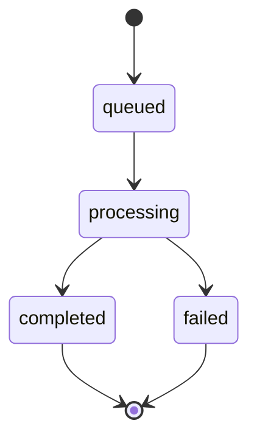

# Transferencias

Transfiere fondos entre cualquier cuenta usando el SDK de Bloque.

## Descripción General

La API de transferencias te permite mover fondos entre diferentes tipos de cuentas:
- Tarjeta a cuenta Virtual
- Tarjeta a cuenta Bancolombia
- Virtual a cuenta Virtual
- Bancolombia a cuenta de Tarjeta
- Y cualquier otra combinación

Todas las transferencias se ponen en cola para su procesamiento y pueden rastrearse usando el ID de cola devuelto.

## Transferencia Básica

Transfiere fondos entre dos cuentas:

```typescript title="basic-transfer.ts"
import { SDK } from '@bloque/sdk';

const bloque = new SDK({
  origin: 'your-origin',
  auth: {
    type: 'apiKey',
    apiKey: process.env.BLOQUE_API_KEY!,
  },
  mode: 'production',
});

const transfer = await bloque.accounts.transfer({
  sourceUrn: 'did:bloque:account:card:usr-123:crd-456',
  destinationUrn: 'did:bloque:account:virtual:acc-67890',
  amount: '1000000000000',
  asset: 'KSM/12',
  metadata: {
    reference: 'payment-123',
    note: 'Monthly subscription'
  }
});

console.log('Transfer queued:', transfer.queueId);
console.log('Status:', transfer.status);
console.log('Message:', transfer.message);
```

## Parámetros

```typescript title="basic-transfer.ts"
interface TransferParams {
  /**
   * URN of the source account
   * @example "did:bloque:account:card:usr-123:crd-456"
   */
  sourceUrn: string;

  /**
   * URN of the destination account
   * @example "did:bloque:account:virtual:acc-67890"
   */
  destinationUrn: string;

  /**
   * Amount to transfer
   * @example "1000000000000"
   */
  amount: string;

  /**
   * Asset to transfer
   * Supported: 'DUSD/6' | 'KSM/12'
   * @example "KSM/12"
   */
  asset: 'DUSD/6' | 'KSM/12';

  /**
   * Optional metadata
   * @example { reference: "payment-123", note: "Payment description" }
   */
  metadata?: Record<string, unknown>;
}
```

## Respuesta

```typescript title="types.ts"
interface TransferResult {
  queueId: string;    // Queue ID for tracking
  status: 'queued' | 'processing' | 'completed' | 'failed';
  message: string;    // Status message
}
```

La transferencia se pone en cola para su procesamiento. Usa el `queueId` para rastrear el estado de la transferencia.

## Estados de Transferencia

Las transferencias siguen un ciclo de vida bien definido desde la cola hasta la finalización:

| Estado | Descripción | Puede Transicionar A |
|--------|-------------|-------------------|
| `queued` | Transferencia en cola, esperando procesamiento | `processing` |
| `processing` | Transferencia en proceso de ejecución | `completed`, `failed` |
| `completed` | Transferencia completada exitosamente | - |
| `failed` | Transferencia fallida | - |



## Ejemplos de Transferencias

### Tarjeta a Bancolombia

Transfiere desde una tarjeta virtual a una cuenta de Bancolombia:

```typescript title="card-to-bancolombia.ts"
const transfer = await bloque.accounts.transfer({
  sourceUrn: 'did:bloque:account:card:usr-123:crd-456',
  destinationUrn: 'did:bloque:account:bancolombia:acc-12345',
  amount: '5000000', // 5 DUSD (6 decimals)
  asset: 'DUSD/6',
  metadata: {
    reference: 'withdrawal-001',
    type: 'savings'
  }
});

console.log(`Transfer queued: ${transfer.queueId}`);
```

### Entre Cuentas Virtuales

Transfiere KSM entre cuentas virtuales:

```typescript title="types.ts"
const transfer = await bloque.accounts.transfer({
  sourceUrn: 'did:bloque:account:virtual:acc-11111',
  destinationUrn: 'did:bloque:account:virtual:acc-22222',
  amount: '2000000000000', // 2 KSM (12 decimals)
  asset: 'KSM/12',
  metadata: {
    reference: 'internal-transfer-42',
    department: 'operations'
  }
});

console.log(`KSM transfer queued: ${transfer.queueId}`);
```

### Tarjeta a Tarjeta

Transfiere entre dos tarjetas:

```typescript title="types.ts"
const transfer = await bloque.accounts.transfer({
  sourceUrn: 'did:bloque:account:card:usr-123:crd-111',
  destinationUrn: 'did:bloque:account:card:usr-456:crd-222',
  amount: '1000000', // 1 DUSD
  asset: 'DUSD/6',
  metadata: {
    reference: 'user-payment-001',
    note: 'Payment for services'
  }
});
```

## Activos Soportados

| Activo | Descripción | Decimales | Ejemplo de Cantidad |
|-------|-------------|----------|----------------|
| `DUSD/6` | Dólar Digital | 6 | `1000000` = 1 DUSD |
| `KSM/12` | Kusama | 12 | `1000000000000` = 1 KSM |

:::tip Conversión de Decimales
Siempre ten en cuenta los decimales al especificar cantidades:
- DUSD/6: Multiplica por 10^6 (1 DUSD = 1,000,000)
- KSM/12: Multiplica por 10^12 (1 KSM = 1,000,000,000,000)
:::

## Metadatos de Transferencia

Agrega metadatos personalizados para rastrear transferencias:

```typescript title="types.ts"
const transfer = await bloque.accounts.transfer({
  sourceUrn: sourceAccount,
  destinationUrn: destinationAccount,
  amount: '1000000',
  asset: 'DUSD/6',
  metadata: {
    // Payment tracking
    reference: 'INV-2025-001',
    invoiceId: 'inv_abc123',

    // Customer info
    customerId: 'cust_xyz789',
    customerName: 'John Doe',

    // Business context
    department: 'Sales',
    project: 'Q1-2025',
    category: 'commission',

    // Notes
    note: 'Sales commission for January 2025',
    approvedBy: 'manager@company.com'
  }
});
```

## Manejo de Errores

Siempre maneja los errores apropiadamente:

```typescript title="types.ts"
try {
  const transfer = await bloque.accounts.transfer({
    sourceUrn: sourceAccount,
    destinationUrn: destinationAccount,
    amount: '1000000',
    asset: 'DUSD/6',
  });

  console.log('✓ Transfer queued:', transfer.queueId);

  // Store transfer info in your database
  await saveTransfer({
    queueId: transfer.queueId,
    status: transfer.status,
    sourceUrn: sourceAccount,
    destinationUrn: destinationAccount,
    amount: '1000000',
    asset: 'DUSD/6',
  });

} catch (error) {
  if (error instanceof Error) {
    console.error('Transfer failed:', error.message);

    // Handle specific errors
    if (error.message.includes('insufficient funds')) {
      // Not enough balance
    } else if (error.message.includes('not found')) {
      // Account doesn't exist
    } else if (error.message.includes('Invalid asset')) {
      // Unsupported asset
    }
  }

  throw error;
}
```

## Ejemplo Completo

```typescript title="complete-transfer.ts"
import { SDK } from '@bloque/sdk';

const bloque = new SDK({
  origin: 'your-origin',
  auth: {
    type: 'apiKey',
    apiKey: process.env.BLOQUE_API_KEY!,
  },
  mode: 'production',
});

async function transferFunds(
  fromUrn: string,
  toUrn: string,
  amount: string,
  asset: 'DUSD/6' | 'KSM/12'
) {
  try {
    // Check source account balance first
    const balances = await bloque.accounts.card.balance({
      urn: fromUrn,
    });

    const available = BigInt(balances[asset]?.current || '0');
    const transferAmount = BigInt(amount);

    if (available < transferAmount) {
      throw new Error('Insufficient funds');
    }

    console.log('✓ Balance check passed');

    // Execute transfer
    const transfer = await bloque.accounts.transfer({
      sourceUrn: fromUrn,
      destinationUrn: toUrn,
      amount,
      asset,
      metadata: {
        timestamp: new Date().toISOString(),
        initiatedBy: 'api-user'
      }
    });

    console.log('✓ Transfer queued');
    console.log('  Queue ID:', transfer.queueId);
    console.log('  Status:', transfer.status);

    return transfer;

  } catch (error) {
    console.error('✗ Transfer failed:', error);
    throw error;
  }
}

// Example usage
await transferFunds(
  'did:bloque:account:card:usr-123:crd-456',
  'did:bloque:account:virtual:acc-67890',
  '1000000', // 1 DUSD
  'DUSD/6'
);
```

## Transferencias por Lotes

Transfiere fondos a múltiples destinos:

```typescript title="batch-transfer.ts"
async function batchTransfer(
  sourceUrn: string,
  destinations: Array<{ urn: string; amount: string }>,
  asset: 'DUSD/6' | 'KSM/12'
) {
  const results = [];

  for (const dest of destinations) {
    try {
      const transfer = await bloque.accounts.transfer({
        sourceUrn,
        destinationUrn: dest.urn,
        amount: dest.amount,
        asset,
      });

      results.push({
        success: true,
        queueId: transfer.queueId,
        destination: dest.urn,
      });

      console.log(`✓ Transfer to ${dest.urn}: ${transfer.queueId}`);

    } catch (error) {
      results.push({
        success: false,
        error: error instanceof Error ? error.message : 'Unknown error',
        destination: dest.urn,
      });

      console.error(`✗ Transfer to ${dest.urn} failed:`, error);
    }
  }

  return results;
}

// Usage
const results = await batchTransfer(
  'did:bloque:account:card:usr-123:crd-456',
  [
    { urn: 'did:bloque:account:virtual:acc-111', amount: '1000000' },
    { urn: 'did:bloque:account:virtual:acc-222', amount: '2000000' },
    { urn: 'did:bloque:account:bancolombia:acc-333', amount: '3000000' },
  ],
  'DUSD/6'
);

console.log(`Completed: ${results.filter(r => r.success).length}/${results.length}`);
```

## Mejores Prácticas

1. **Verifica Saldos**: Verifica que haya fondos suficientes antes de transferir
2. **Valida URNs**: Asegúrate de que los URNs de las cuentas sean válidos
3. **Decimales de Activos**: Ten en cuenta los lugares decimales apropiados
4. **Manejo de Errores**: Usa bloques try-catch
5. **Metadatos**: Agrega información de rastreo
6. **Prueba Primero**: Prueba en modo sandbox
7. **Almacena IDs de Cola**: Guarda los IDs de cola para rastreo

## Próximos Pasos

- [Tarjetas Virtuales](/sdk/guide/accounts/cards) - Gestionar cuentas de tarjeta
- [Bancolombia](/sdk/guide/accounts/bancolombia) - Integración con Bancolombia
- [Descripción General](/sdk/guide/accounts/overview) - Descripción general de cuentas
