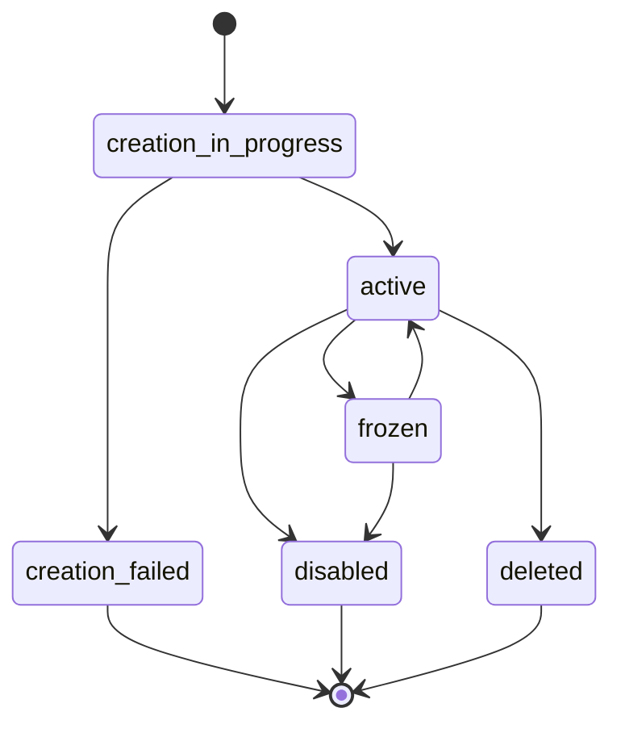

# Cuentas US (Bridge)

Crea y gestiona cuentas bancarias de Estados Unidos usando el SDK de Bloque con Bridge.

## Descripción General

Las cuentas US son cuentas bancarias reales en Estados Unidos proporcionadas por Bridge. Permiten:

- **Cuentas Bancarias Reales**: Cuentas de depósito FDIC en bancos de EE.UU.
- **KYC Completo**: Verificación de identidad y cumplimiento regulatorio
- **ACH y Wire**: Recibe y envía transferencias bancarias
- **Individuales y Empresariales**: Soporte para personas y negocios
- **Términos y Condiciones**: Proceso de aceptación de TOS requerido

## Flujo de Creación

La creación de cuentas US requiere un proceso de dos pasos:

1. **Obtener Link de TOS**: Genera un link para que el usuario acepte los términos y condiciones
2. **Crear Cuenta**: Usa el `signedAgreementId` recibido para crear la cuenta

### Paso 1: Generar Link de Términos y Condiciones

```typescript title="obtener-tos-link.ts"
import { SDK } from '@bloque/sdk';

const bloque = new SDK({
  origin: 'tu-origen',
  auth: {
    type: 'apiKey',
    apiKey: process.env.BLOQUE_API_KEY!,
  },
  mode: 'production',
});

// Generar link de TOS
const tosLink = await bloque.accounts.us.getTosLink({
  redirectUri: 'https://tuapp.com/callback',
});

console.log('URL de TOS:', tosLink.url);
```

**Respuesta:**

```typescript title="tipos.ts"
interface TosLinkResponse {
  url: string;        // URL del formulario de aceptación de TOS
}
```

:::tip Embeber el Link
Puedes embeber `tosLink.url` en un iframe, abrirlo en una nueva ventana o enviarlo por email. El usuario será redirigido a `redirectUri` después de aceptar los términos.
:::

### Paso 2: Capturar el Signed Agreement ID

Después de que el usuario acepta los términos, Bridge redirigirá a tu `redirectUri` con el `signed_agreement_id` como parámetro de query:

```
https://tuapp.com/callback?signed_agreement_id=0d139f8e-14b0-4540-92ba-4e66c619b533
```

### Paso 3: Crear la Cuenta

Una vez que tienes el `signedAgreementId`, puedes crear la cuenta:

```typescript title="crear-cuenta-us.ts"
// Crear cuenta individual
const account = await bloque.accounts.us.create({
  type: 'individual',
  firstName: 'Roberto',
  middleName: 'Carlos',
  lastName: 'González',
  email: 'roberto.gonzalez@example.com',
  phone: '+12125551234',
  address: {
    streetLine1: '456 Wall Street',
    streetLine2: 'Suite 789',
    city: 'New York',
    state: 'NY',
    postalCode: '10005',
    country: 'US',
  },
  birthDate: '1985-03-15',
  taxIdentificationNumber: '123-45-6789',
  govIdCountry: 'US',
  govIdImageFront: 'base64_encoded_image_here',
  signedAgreementId: '0d139f8e-14b0-4540-92ba-4e66c619b533', // Del callback
  webhookUrl: 'https://api.example.com/webhooks/account-events',
  metadata: {
    source: 'mobile_app',
    version: '1.0',
    kyc_level: 'basic',
  },
});

console.log('Cuenta creada:', account.urn);
console.log('Estado:', account.status);
```

## Parámetros de Creación

### Cuenta Individual

```typescript title="tipos.ts"
interface CreateUSAccountParams {
  type: 'individual';
  firstName: string;                    // Nombre
  middleName?: string;                  // Segundo nombre (opcional)
  lastName: string;                     // Apellido
  email: string;                        // Email
  phone: string;                        // Teléfono (formato E.164)
  address: {
    streetLine1: string;                // Dirección línea 1
    streetLine2?: string;               // Dirección línea 2 (opcional)
    city: string;                       // Ciudad
    state: string;                      // Estado (código de 2 letras)
    postalCode: string;                 // Código postal
    country: string;                    // País (código ISO de 2 letras)
  };
  birthDate: string;                    // Fecha de nacimiento (YYYY-MM-DD)
  taxIdentificationNumber: string;      // SSN o EIN
  govIdCountry: string;                 // País de emisión del ID
  govIdImageFront: string;              // Imagen frontal del ID (base64)
  govIdImageBack?: string;              // Imagen trasera del ID (base64, opcional)
  signedAgreementId: string;            // ID del acuerdo firmado (del TOS)
  webhookUrl?: string;                  // URL de webhook (opcional)
  metadata?: Record<string, string>;    // Metadata personalizada (opcional)
}
```

### Cuenta Empresarial

```typescript title="tipos.ts"
interface CreateUSBusinessAccountParams {
  type: 'business';
  businessName: string;                 // Nombre del negocio
  businessType: string;                 // Tipo de entidad (LLC, Corporation, etc.)
  taxIdentificationNumber: string;      // EIN del negocio
  address: {
    streetLine1: string;
    streetLine2?: string;
    city: string;
    state: string;
    postalCode: string;
    country: string;
  };
  email: string;
  phone: string;
  // Representante autorizado
  representative: {
    firstName: string;
    middleName?: string;
    lastName: string;
    birthDate: string;
    taxIdentificationNumber: string;
    govIdCountry: string;
    govIdImageFront: string;
    govIdImageBack?: string;
  };
  signedAgreementId: string;
  webhookUrl?: string;
  metadata?: Record<string, string>;
}
```

## Respuesta

```typescript title="tipos.ts"
interface USAccount {
  urn: string;                          // Nombre de recurso único
  id: string;                           // ID de la cuenta
  type: 'individual' | 'business';      // Tipo de cuenta
  status: USAccountStatus;              // Estado de la cuenta
  ownerUrn: string;                     // URN del propietario
  ledgerId: string;                     // ID de cuenta ledger

  // Información de la cuenta
  firstName?: string;                   // Para cuentas individuales
  middleName?: string;
  lastName?: string;
  businessName?: string;                // Para cuentas empresariales
  email: string;
  phone: string;

  // Información bancaria
  accountNumber?: string;               // Número de cuenta (cuando está disponible)
  routingNumber?: string;               // Número de routing (cuando está disponible)

  // Balances
  balance?: {
    available: number;                  // Balance disponible
    current: number;                    // Balance actual
    currency: string;                   // Moneda (USD)
  };

  webhookUrl: string | null;
  metadata?: Record<string, string>;
  createdAt: string;                    // Timestamp ISO 8601
  updatedAt: string;                    // Timestamp ISO 8601
}

type USAccountStatus =
  | 'creation_in_progress'              // Creación en progreso
  | 'active'                           // Activa
  | 'disabled'                         // Deshabilitada
  | 'frozen'                           // Congelada
  | 'deleted'                          // Eliminada
  | 'creation_failed';                 // Creación fallida
```

## Gestionar Cuentas US

### Listar Cuentas

Obtén todas las cuentas US de un usuario:

```typescript title="listar-cuentas.ts"
const accounts = await bloque.accounts.us.list();

console.log(`Total de cuentas: ${accounts.accounts.length}`);

accounts.accounts.forEach(account => {
  console.log(`${account.urn}: ${account.status}`);
  if (account.balance) {
    console.log(`  DUSD/6: ${account.balance['DUSD/6']?.current ?? '0'}`);
  }
});
```

### Actualizar Metadata

Actualiza metadata personalizada en una cuenta US:

```typescript title="actualizar-metadata.ts"
const actualizada = await bloque.accounts.us.updateMetadata({
  urn: 'did:bloque:mediums:us:account:123e4567',
  metadata: {
    updated_by: 'admin',
    update_reason: 'customer_request',
    kyc_level: 'enhanced',
  },
});

console.log('Metadata actualizada:', actualizada.metadata);
```

:::warning Restricciones de Metadata
Todos los valores de metadata deben ser strings.
:::

### Estados de Cuenta

Gestiona el estado de las cuentas US:

```typescript title="gestionar-estado.ts"
const accountUrn = 'did:bloque:mediums:us:account:123e4567';

// Activar cuenta
const activada = await bloque.accounts.us.activate(accountUrn);
console.log('Estado:', activada.status); // 'active'

// Congelar cuenta (suspender temporalmente)
const congelada = await bloque.accounts.us.freeze(accountUrn);
console.log('Estado:', congelada.status); // 'frozen'

// Deshabilitar cuenta (permanentemente)
const deshabilitada = await bloque.accounts.us.disable(accountUrn);
console.log('Estado:', deshabilitada.status); // 'disabled'
```

#### Estados Disponibles

| Estado | Descripción | Puede Transicionar A |
|--------|-------------|---------------------|
| `creation_in_progress` | La cuenta se está creando | `active`, `creation_failed` |
| `active` | Cuenta activa y usable | `frozen`, `disabled`, `deleted` |
| `frozen` | Cuenta temporalmente suspendida | `active`, `disabled` |
| `disabled` | Cuenta permanentemente deshabilitada | - |
| `deleted` | Cuenta eliminada | - |
| `creation_failed` | Creación de cuenta fallida | - |



## Ejemplo Completo

```typescript title="ejemplo-completo.ts"
import { SDK } from '@bloque/sdk';

async function crearCuentaUS() {
  // Inicializar SDK
  const bloque = new SDK({
    origin: 'tu-origen',
    auth: {
      type: 'apiKey',
      apiKey: process.env.BLOQUE_API_KEY!,
    },
    mode: 'production',
  });

  try {
    // Paso 1: Obtener link de TOS
    console.log('Generando link de términos y condiciones...');
    const tosLink = await bloque.accounts.us.getTosLink({
      redirectUri: 'https://tuapp.com/callback',
    });

    console.log('Link de TOS:', tosLink.url);
    console.log('Comparte este link con tu usuario para aceptar términos');

    // El usuario visita tosLink.url y acepta los términos
    // Tu callback recibe: ?signed_agreement_id=xxx

    // Paso 2: Crear cuenta con el signedAgreementId
    console.log('\nCreando cuenta US...');
    const account = await bloque.accounts.us.create({
      type: 'individual',
      firstName: 'Roberto',
      middleName: 'Carlos',
      lastName: 'González',
      email: 'roberto.gonzalez@example.com',
      phone: '+12125551234',
      address: {
        streetLine1: '456 Wall Street',
        streetLine2: 'Suite 789',
        city: 'New York',
        state: 'NY',
        postalCode: '10005',
        country: 'US',
      },
      birthDate: '1985-03-15',
      taxIdentificationNumber: '123-45-6789',
      govIdCountry: 'US',
      govIdImageFront: 'base64_encoded_image_here',
      signedAgreementId: '0d139f8e-14b0-4540-92ba-4e66c619b533',
      webhookUrl: 'https://api.example.com/webhooks/account-events',
      metadata: {
        source: 'web',
        kyc_level: 'basic',
      },
    });

    console.log('✓ Cuenta creada:', account.urn);
    console.log('✓ Estado:', account.status);
    console.log('✓ Ledger ID:', account.ledgerId);

    // Listar todas las cuentas
    console.log('\nListando cuentas...');
    const accounts = await bloque.accounts.us.list();
    console.log(`✓ Total de cuentas: ${accounts.accounts.length}`);

    return { success: true, account };
  } catch (error) {
    console.error('✗ Error:', error);
    throw error;
  }
}

crearCuentaUS().catch(console.error);
```

## Manejo de Errores

```typescript title="manejo-errores.ts"
import {
  BloqueValidationError,
  BloqueNotFoundError,
  BloqueAuthenticationError,
} from '@bloque/sdk';

try {
  const tosLink = await bloque.accounts.us.getTosLink({
    redirectUri: 'https://tuapp.com/callback',
  });

  const account = await bloque.accounts.us.create({
    type: 'individual',
    firstName: 'Roberto',
    lastName: 'González',
    // ... otros parámetros
    signedAgreementId: 'xxx-xxx-xxx',
  });

  console.log('Cuenta creada:', account.urn);
} catch (error) {
  if (error instanceof BloqueValidationError) {
    console.error('Validación fallida:', error.validationErrors);
    // Manejar entrada inválida
  } else if (error instanceof BloqueNotFoundError) {
    console.error('Recurso no encontrado:', error.resourceId);
    // Manejar signedAgreementId inválido
  } else if (error instanceof BloqueAuthenticationError) {
    console.error('Autenticación fallida');
    // Manejar problemas de autenticación
  } else {
    console.error('Error inesperado:', error);
  }
}
```

## Mejores Prácticas

1. **Flujo de TOS**: Siempre completa el flujo de aceptación de términos antes de crear la cuenta
2. **Embeber el Link**: Puedes embeber el link de TOS en un iframe o modal para mejor UX
3. **Validación de Datos**: Valida los datos del usuario antes de enviarlos
4. **Imágenes de ID**: Asegúrate de que las imágenes estén en formato base64 y sean legibles
5. **Formato de Teléfono**: Usa formato E.164 para números de teléfono (+1XXXXXXXXXX)
6. **Webhooks**: Configura webhooks para recibir actualizaciones de estado
7. **Manejo de Errores**: Implementa manejo robusto de errores para el flujo de KYC
8. **Metadata**: Usa metadata para rastrear origen de cuentas y propósitos

## Diferencias con Otros Tipos de Cuenta

| Característica | Cuentas US | Cuentas Virtuales | Tarjetas Virtuales |
|----------------|-----------|-------------------|-------------------|
| **KYC Requerido** | Sí (completo) | No | Sí |
| **TOS Requerido** | Sí | No | No |
| **Tiempo de Creación** | Minutos-días | Instantáneo | Instantáneo |
| **Caso de Uso** | Cuentas bancarias reales | Pruebas | Pagos |
| **Regulación** | FDIC, FinCEN | N/A | PCI-DSS |
| **Información Requerida** | Completa | Básica | Básica |

## Próximos Pasos

- [Transferencias](/sdk/guide/accounts/transfers) - Transferir fondos entre cuentas
- [Tarjetas Virtuales](/sdk/guide/accounts/cards) - Crear tarjetas de pago
- [Bancolombia](/sdk/guide/accounts/bancolombia) - Integración con Bancolombia
