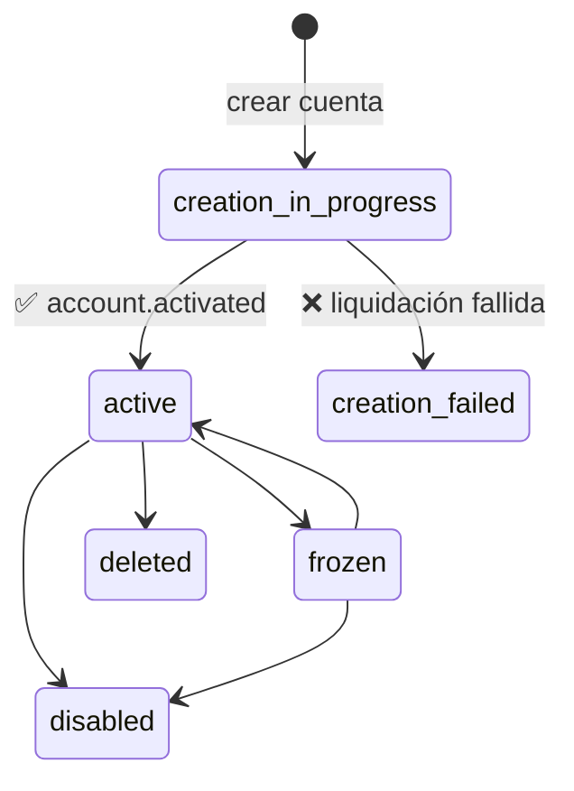

# Webhooks de Cuentas

Recibe notificaciones en tiempo real cuando ocurren eventos del ciclo de vida de las cuentas.

## Descripción General

Cuando proporcionas un `webhookUrl` al crear una cuenta, tu endpoint recibe notificaciones POST para eventos del ciclo de vida — cambios de estado, confirmaciones de activación y más. Esto aplica a **todos los tipos de cuenta**: virtual, tarjeta, bancolombia, US y polygon.

:::tip Eventos Específicos por Medio
Las cuentas de tarjeta también reciben webhooks específicos de transacciones (compras, reembolsos, rechazos). Consulta la sección [Webhooks de Tarjetas](/sdk/guide/accounts/cards#card-webhooks) para esos eventos.
:::

## Configuración de Webhooks

Pasa un `webhookUrl` al crear cualquier cuenta:

```typescript title="create-with-webhook.ts"
// Cuenta virtual
const virtual = await session.accounts.virtual.create({
  firstName: 'Juan',
  lastName: 'Pérez',
  webhookUrl: 'https://api.ejemplo.com/webhooks/cuentas',
});

// Cuenta de tarjeta
const card = await session.accounts.card.create({
  userUrn: 'did:bloque:tu-origin:usuario-123',
  webhookUrl: 'https://api.ejemplo.com/webhooks/cuentas',
});

// Cuenta Bancolombia
const bancolombia = await session.accounts.bancolombia.create({
  webhookUrl: 'https://api.ejemplo.com/webhooks/cuentas',
});
```

Tu endpoint debe:
- Aceptar solicitudes `POST` con cuerpo JSON
- Responder con un código de estado `2xx` para confirmar la recepción
- Ser accesible públicamente (sin autenticación requerida de tu lado)

## Estructura del Payload

Todos los eventos del ciclo de vida de cuentas comparten esta estructura:

```typescript title="types.ts"
interface AccountWebhookPayload {
  account_urn: string;                  // URN de la cuenta
  medium: string;                       // Tipo de cuenta: "virtual", "card", "bancolombia", etc.
  event_type: AccountEventType;         // Identificador del evento
  event_data: Record<string, unknown>;  // Datos específicos del evento
  timestamp: string;                    // Marca de tiempo ISO 8601
}
```

## Eventos

### `account.activated`

Se dispara cuando una cuenta pasa de `creation_in_progress` a `active` después de que la liquidación on-chain es confirmada. Esta es la señal de que la cuenta está completamente operativa — se pueden recibir y enviar fondos.

```json title="account-activated.json"
{
  "account_urn": "did:bloque:account:virtual:acc-12345",
  "medium": "virtual",
  "event_type": "account.activated",
  "event_data": {
    "status": "active",
    "settlement_status": "confirmed",
    "confirmed_at": "2025-03-15T14:30:00.000Z",
    "operations_count": 2
  },
  "timestamp": "2025-03-15T14:30:01.123Z"
}
```

| Campo | Tipo | Descripción |
|-------|------|-------------|
| `event_data.status` | `string` | Siempre `"active"` para este evento. |
| `event_data.settlement_status` | `string` | Estado de liquidación en blockchain: `"confirmed"` o `"settled"`. |
| `event_data.confirmed_at` | `string` | Marca de tiempo ISO 8601 de la confirmación on-chain. |
| `event_data.operations_count` | `number` | Número de operaciones en lote liquidadas (ej. transferencia de faucet + registro de controlador). |

## Manejo de Webhooks

```typescript title="account-webhook-handler.ts"
import express from 'express';

const app = express();

app.post('/webhooks/cuentas', express.json(), (req, res) => {
  const { account_urn, medium, event_type, event_data, timestamp } = req.body;

  console.log(`[${timestamp}] ${event_type} para ${account_urn} (${medium})`);

  switch (event_type) {
    case 'account.activated':
      console.log(`Cuenta activa — liquidación: ${event_data.settlement_status}`);
      // Habilitar funcionalidades de la cuenta en tu aplicación
      // Notificar al usuario que su cuenta está lista
      activarCuentaUsuario(account_urn);
      break;

    default:
      console.log(`Evento no manejado: ${event_type}`);
  }

  // Siempre responder 2xx para confirmar la recepción
  res.status(200).send('OK');
});
```

### Con Idempotencia

La entrega de webhooks usa claves de idempotencia, pero tu handler también debe ser idempotente — procesar el mismo evento dos veces debe producir el mismo resultado:

```typescript title="idempotent-handler.ts"
const eventsProcesados = new Set<string>();

app.post('/webhooks/cuentas', express.json(), async (req, res) => {
  const { account_urn, event_type, timestamp } = req.body;
  const claveEvento = `${account_urn}:${event_type}:${timestamp}`;

  if (eventsProcesados.has(claveEvento)) {
    return res.status(200).send('Ya procesado');
  }

  // Procesar el evento
  await manejarEventoCuenta(req.body);
  eventsProcesados.add(claveEvento);

  res.status(200).send('OK');
});
```

:::warning Idempotencia en Producción
El `Set` en memoria anterior es solo ilustrativo. En producción, usa un almacén persistente (base de datos, Redis) para rastrear eventos procesados entre reinicios e instancias.
:::

## Ciclo de Vida de Cuentas y Webhooks



El evento `account.activated` se dispara en la transición `creation_in_progress → active`, que ocurre después de que la liquidación del lote on-chain (registro de controlador y financiamiento inicial) es confirmada.

## Mejores Prácticas

1. **Responde rápido**: Retorna `200` inmediatamente, luego procesa asincrónicamente. Los handlers de larga duración pueden causar timeouts de entrega.
2. **Sé idempotente**: El mismo evento puede entregarse más de una vez. Usa la combinación de `account_urn + event_type + timestamp` como clave de deduplicación.
3. **Usa HTTPS**: Siempre usa URLs HTTPS para proteger los payloads de webhooks en tránsito.
4. **Registra todo**: Registra los payloads entrantes para depuración y auditoría.
5. **Maneja eventos desconocidos**: Se pueden agregar nuevos tipos de eventos. No falles ante valores `event_type` no reconocidos — regístralos y confírmalos.
6. **Monitorea fallos**: Si tu endpoint retorna respuestas no-2xx repetidamente, la entrega de webhooks puede pausarse. Monitorea la salud de tu endpoint.

## Siguientes Pasos

- [Máquinas de Estado](/sdk/guide/features/state-machines/overview) — Documentación completa del ciclo de vida de cuentas
- [Cuentas Virtuales](/sdk/guide/accounts/virtual) — Creación y gestión de cuentas virtuales
- [Tarjetas Virtuales](/sdk/guide/accounts/cards#card-webhooks) — Webhooks de transacciones de tarjetas
- [Transferencias](/sdk/guide/accounts/transfers) — Transferir fondos entre cuentas
