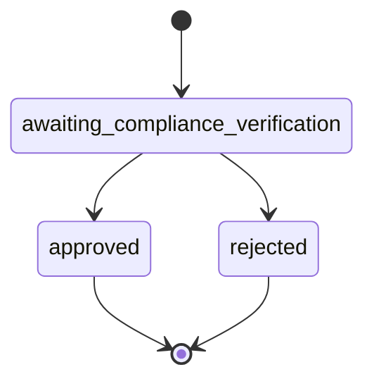

# Cumplimiento y KYC

Aprende cómo implementar la verificación de KYC (Conocer a tu Cliente) usando el SDK de Bloque.

## Descripción General

El módulo de cumplimiento proporciona herramientas para la verificación de KYC, permitiéndote verificar identidades de usuarios y mantener el cumplimiento regulatorio.

## Iniciando la Verificación de KYC

Inicia un proceso de verificación de KYC para un usuario:

```typescript
import { SDK } from '@bloque/sdk';
import type { KycVerificationParams } from '@bloque/sdk/compliance';

const bloque = new SDK({
  origin: 'your-origin',
  auth: {
    type: 'apiKey',
    apiKey: process.env.BLOQUE_API_KEY!,
  },
  mode: 'production',
});

const params: KycVerificationParams = {
  urn: 'did:bloque:user:123e4567',
  webhookUrl: 'https://api.example.com/webhooks/kyc', // Optional
};

const verification = await bloque.compliance.kyc.startVerification(params);

console.log('Verification URL:', verification.url);
console.log('Status:', verification.status);
```

## Parámetros

### KycVerificationParams

| Campo | Tipo | Requerido | Descripción |
|-------|------|----------|-------------|
| `urn` | `string` | Sí | URN del usuario a verificar |
| `webhookUrl` | `string` | No | URL para notificaciones de cambio de estado |

## Respuesta

### KycVerificationResponse

```typescript
interface KycVerificationResponse {
  url: string;           // URL para que el usuario complete la verificación
  status: string;        // Estado actual de la verificación
  completedAt: string | null;  // Marca de tiempo de finalización
}
```

### Estado de Verificación

| Estado | Descripción | Puede Transicionar A |
|--------|-------------|-------------------|
| `awaiting_compliance_verification` | Verificación pendiente | `approved`, `rejected` |
| `approved` | Verificación aprobada | - |
| `rejected` | Verificación rechazada | - |



## Obteniendo el Estado de Verificación

Verifica el estado de una verificación existente:

```typescript
import type { GetKycVerificationParams } from '@bloque/sdk/compliance';

const params: GetKycVerificationParams = {
  urn: 'did:bloque:user:123e4567',
};

const status = await bloque.compliance.kyc.getVerification(params);

console.log('Estado:', status.status);
console.log('Completado en:', status.completedAt);

if (status.status === 'approved') {
  console.log('¡Usuario verificado!');
} else if (status.status === 'rejected') {
  console.log('Verificación fue rechazada');
} else {
  console.log('Verificación aún pendiente');
}
```

## Integración de Webhooks

Configura webhooks para recibir actualizaciones en tiempo real sobre cambios de estado de verificación:

### Configurando Webhooks

```typescript
const verification = await bloque.compliance.kyc.startVerification({
  urn: 'did:bloque:user:123e4567',
  webhookUrl: 'https://api.example.com/webhooks/kyc',
});
```

### Carga útil de Webhook

Tu punto final de webhook recibirá solicitudes POST con la siguiente carga útil:

```typescript
{
  "type": "kyc.status_changed",
  "data": {
    "urn": "did:bloque:user:123e4567",
    "status": "approved",
    "completedAt": "2024-01-15T10:30:00Z"
  }
}
```

### Ejemplo de Manejador de Webhook

```typescript
import express from 'express';

const app = express();

app.post('/webhooks/kyc', express.json(), (req, res) => {
  const { type, data } = req.body;

  if (type === 'kyc.status_changed') {
    console.log('Estado KYC cambió para:', data.urn);
    console.log('Nuevo estado:', data.status);

    // Actualiza tu base de datos, envía notificaciones, etc.
    if (data.status === 'approved') {
      // Habilita funciones para usuario verificado
    }
  }

  res.status(200).send('OK');
});
```

## Flujo Completo

Aquí hay un flujo completo de verificación de KYC:

```typescript
import { SDK } from '@bloque/sdk';

const bloque = new SDK({
  origin: 'your-origin',
  auth: {
    type: 'apiKey',
    apiKey: process.env.BLOQUE_API_KEY!,
  },
  mode: 'production',
});

async function handleKYCVerification(userUrn: string) {
  try {
    // 1. Iniciar verificación
    const verification = await bloque.compliance.kyc.startVerification({
      urn: userUrn,
      webhookUrl: 'https://api.example.com/webhooks/kyc',
    });

    console.log('✓ Verificación iniciada');
    console.log('  Envía usuario a:', verification.url);

    // 2. Almacena información de verificación en tu base de datos
    await saveVerification({
      userUrn,
      verificationUrl: verification.url,
      status: verification.status,
    });

    // 3. Redirige usuario a URL de verificación
    return verification.url;

  } catch (error) {
    console.error('Error al iniciar verificación:', error);
    throw error;
  }
}

async function checkVerificationStatus(userUrn: string) {
  try {
    const status = await bloque.compliance.kyc.getVerification({
      urn: userUrn,
    });

    console.log('Estado actual:', status.status);

    if (status.status === 'approved') {
      // Actualiza permisos de usuario
      await updateUserPermissions(userUrn, { verified: true });
    }

    return status;

  } catch (error) {
    console.error('Error al obtener estado:', error);
    throw error;
  }
}
```

## Flujo de Experiencia del Usuario

1. **Usuario inicia verificación** en tu aplicación
2. **Tu app llama** `startVerification()`
3. **Redirige usuario** a la URL de verificación devuelta
4. **Usuario completa** proceso de KYC en la página del proveedor
5. **Notificación de webhook** enviada a tu punto final
6. **Actualiza estado de usuario** en tu sistema

## Mejores Prácticas de Seguridad

1. **Valida Webhooks**: Implementa validación de firma de webhook
2. **Solo HTTPS**: Usa HTTPS para URLs de webhook
3. **Idempotencia**: Maneja entregas duplicadas de webhook
4. **Manejo de Timeouts**: Establece timeouts apropiados para llamadas de API
5. **Registro de Errores**: Registra todos los intentos de verificación y errores

## Pruebas

Usa modo sandbox para probar sin verificaciones reales:

```typescript
const bloque = new SDK({
  origin: 'your-origin',
  auth: {
    type: 'apiKey',
    apiKey: process.env.BLOQUE_API_KEY!,
  },
  mode: 'sandbox', // Modo de prueba
});

// La verificación de prueba se devolverá inmediatamente
const verification = await bloque.compliance.kyc.startVerification({
  urn: 'did:bloque:user:test-123',
});
```

## Próximos Pasos

- [Guía de Cuentas](/sdk/guide/accounts/overview) - Crea tarjetas virtuales para usuarios verificados
- [Guía de Organizaciones](/sdk/guide/features/organizations) - Administra cuentas empresariales
