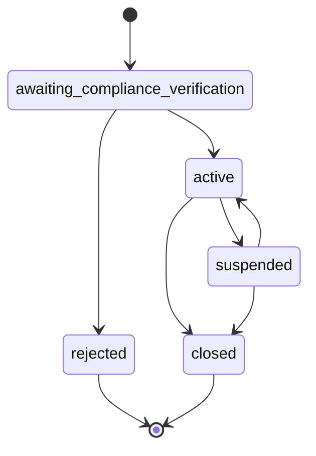

# Organizaciones

Aprende cómo crear y gestionar organizaciones usando el SDK de Bloque.

## Descripción General

Las organizaciones son la base de la plataforma Bloque. Pueden ser empresas o individuos y contienen toda la información de perfil y cumplimiento normativo necesaria.

## Crear una Organización

### Organización de Negocios

```typescript
import { SDK } from '@bloque/sdk';
import type { CreateOrgParams } from '@bloque/sdk/orgs';

const bloque = new SDK({
  origin: 'your-origin',
  auth: {
    type: 'apiKey',
    apiKey: process.env.BLOQUE_API_KEY!,
  },
  mode: 'production',
});

const params: CreateOrgParams = {
  org_type: 'business',
  profile: {
    legal_name: 'Acme Corporation',
    tax_id: '123456789',
    incorporation_date: '2020-01-01',
    business_type: 'llc',
    incorporation_country_code: 'US',
    incorporation_state: 'CA',
    address_line1: '123 Main St',
    postal_code: '94103',
    city: 'San Francisco',
  },
  metadata: {
    source: 'web_app',
    campaign: 'q1_2024',
  },
};

const organization = await bloque.orgs.create(params);
```

### Organización Individual

```typescript
const params: CreateOrgParams = {
  org_type: 'individual',
  profile: {
    legal_name: 'John Doe',
    tax_id: '123-45-6789',
    incorporation_date: '1990-05-20',
    business_type: 'sole_proprietorship',
    incorporation_country_code: 'US',
    address_line1: '456 Oak Ave',
    postal_code: '10001',
    city: 'New York',
  },
};

const organization = await bloque.orgs.create(params);
```

## Parámetros

### CreateOrgParams

| Campo | Tipo | Requerido | Descripción |
|-------|------|----------|-------------|
| `org_type` | `'business' \| 'individual'` | Sí | Tipo de organización |
| `profile` | `OrgProfile` | Sí | Detalles del perfil de la organización |
| `metadata` | `Record<string, unknown>` | No | Metadatos personalizados |

### OrgProfile

| Campo | Tipo | Requerido | Descripción |
|-------|------|----------|-------------|
| `legal_name` | `string` | Sí | Nombre legal de la organización |
| `tax_id` | `string` | Sí | Número de ID fiscal |
| `incorporation_date` | `string` | Sí | Fecha de incorporación (YYYY-MM-DD) |
| `business_type` | `string` | Sí | Tipo de negocio (ej: 'llc', 'corporation') |
| `incorporation_country_code` | `string` | Sí | Código de país (ISO 3166-1 alpha-2) |
| `incorporation_state` | `string` | No | Estado/provincia |
| `address_line1` | `string` | Sí | Línea de dirección principal |
| `address_line2` | `string` | No | Línea de dirección secundaria |
| `postal_code` | `string` | Sí | Código postal/ZIP |
| `city` | `string` | Sí | Ciudad |
| `logo_url` | `string` | No | URL del logo |
| `places` | `Place[]` | No | Ubicaciones adicionales |

## Respuesta

### Organization

```typescript
interface Organization {
  urn: string;                           // Nombre único de recurso
  org_type: 'business' | 'individual';   // Tipo de organización
  profile: OrgProfile;                   // Perfil de la organización
  metadata?: Record<string, unknown>;    // Metadatos personalizados
  status: OrgStatus;                     // Estado de la organización
}
```

### Estado de la Organización

| Estado | Descripción | Puede Transicionar A |
|--------|-------------|-------------------|
| `awaiting_compliance_verification` | Pendiente de verificación de cumplimiento normativo | `active`, `rejected` |
| `active` | La organización está activa | `suspended`, `closed` |
| `suspended` | La organización está suspendida | `active`, `closed` |
| `closed` | La organización está cerrada | - |



## Organizaciones con Múltiples Ubicaciones

Para organizaciones con múltiples ubicaciones, utiliza el campo `places`:

```typescript
const params: CreateOrgParams = {
  org_type: 'business',
  profile: {
    legal_name: 'Global Tech Inc',
    tax_id: '98-7654321',
    incorporation_date: '2018-03-10',
    business_type: 'corporation',
    incorporation_country_code: 'US',
    incorporation_state: 'DE',
    address_line1: '789 Corporate Blvd',
    postal_code: '19801',
    city: 'Wilmington',
    places: [
      {
        country_code: 'US',
        state: 'CA',
        address_line1: '100 Silicon Valley Dr',
        postal_code: '94025',
        city: 'Menlo Park',
        is_primary: true,
      },
      {
        country_code: 'US',
        state: 'NY',
        address_line1: '250 Broadway',
        postal_code: '10007',
        city: 'New York',
        is_primary: false,
      },
    ],
  },
};
```

## Metadatos Personalizados

Agrega campos personalizados para rastrear información adicional:

```typescript
const params: CreateOrgParams = {
  org_type: 'business',
  profile: {
    // ... profile fields
  },
  metadata: {
    source: 'api',
    customer_id: 'cust_123',
    plan: 'enterprise',
    referral_code: 'REF2024',
  },
};
```

## Mejores Prácticas

1. **Valida los Datos**: Asegúrate de que todos los campos requeridos estén presentes antes de llamar a la API
2. **Maneja Errores**: Siempre usa bloques try-catch
3. **Guarda URNs**: Almacena el URN de la organización para operaciones futuras
4. **Usa Metadatos**: Rastrea contexto adicional usando metadatos
5. **Prueba en Sandbox**: Siempre prueba con `mode: 'sandbox'` primero

## Próximos Pasos

- [Guía de Cumplimiento Normativo](/sdk/guide/features/compliance) - Agrega verificación KYC
- [Guía de Cuentas](/sdk/guide/accounts/overview) - Crea tarjetas virtuales y cuentas
