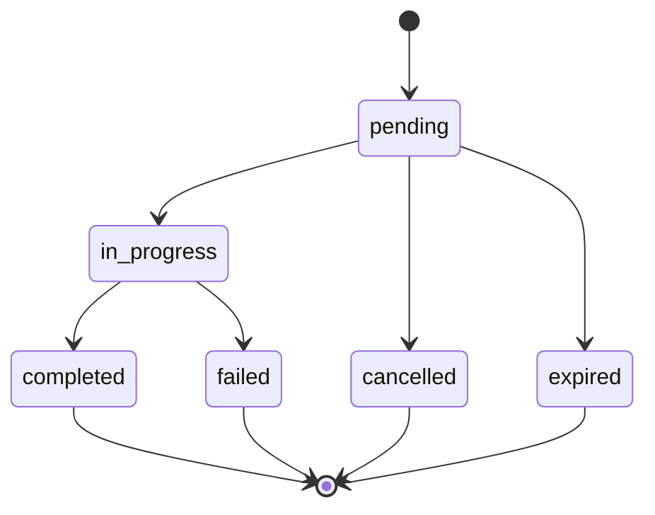
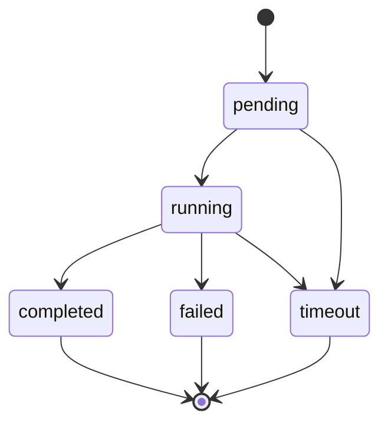

# Swap

Aprende cómo realizar intercambios de activos usando el SDK de Bloque.

## Descripción General

El módulo swap permite consultar tasas de cambio y realizar intercambios de activos entre diferentes medios y monedas soportadas.

## Realizando una Consulta de Tasas

```typescript
import { SDK } from '@bloque/sdk';

const bloque = new SDK({
  origin: 'your-origin',
  auth: {
    type: 'apiKey',
    apiKey: process.env.BLOQUE_API_KEY!,
  },
  mode: 'production',
});

const userSession = await bloque.connect('user-alias');

const result = await userSession.swap.findRates({
  fromAsset: 'COP/2',
  toAsset: 'DUSD/6',
  fromMediums: ['bancolombia', 'pse'], // required
  toMediums: ['kusama'], // required
  amountSrc: '50000000', // 500000.00 COP (scaled by 2 decimals)
  sort: 'asc', // optional, default: 'asc'
  sortBy: 'rate', // optional, default: 'rate'
});
console.log('Swap rates result:', result);
```

## Parámetros

### FindRatesParams

| Campo         | Tipo         | Requerido | Descripción                                                                 |
|-------------- |--------------|-----------|-----------------------------------------------------------------------------|
| `fromAsset`   | `string`     | Sí        | Activo origen con precisión (ej: "COP/2")                                  |
| `toAsset`     | `string`     | Sí        | Activo destino con precisión (ej: "DUSD/6")                                |
| `fromMediums` | `string[]`   | Sí        | Medios de pago origen (ej: `["bancolombia"]`)                              |
| `toMediums`   | `string[]`   | Sí        | Medios de pago destino (ej: `["kusama"]`)                                  |
| `amountSrc`   | `string`     | Opcional  | Monto origen como string bigint (escalar según precisión)                    |
| `amountDst`   | `string`     | Opcional  | Monto destino como string bigint (escalar según precisión)                   |
| `sort`        | `'asc'|'desc'`| Opcional | Orden de resultados (por defecto 'asc')                                     |
| `sortBy`      | `'rate'|'at'` | Opcional | Campo de ordenamiento ('rate' por defecto)                                  |

## Respuesta

### FindRatesResult

```typescript
interface FindRatesResult {
  rates: SwapRate[];
}
```

### SwapRate

```typescript
interface SwapRate {
  id: string;
  sig: string;
  swapSig: string;
  maker: string;
  edge: [string, string];
  fee: Fee;
  at: string;
  until: string;
  fromMediums: string[];
  toMediums: string[];
  rate: [number, number];
  ratio: number;
  fromLimits: [string, string];
  toLimits: [string, string];
  createdAt: string;
  updatedAt: string;
}
```

### Fee

```typescript
interface Fee {
  at: number;
  value: number;
  formula: string;
  components: FeeComponent[];
}
```

### FeeComponent

```typescript
interface FeeComponent {
  at: number;
  name: string;
  type: 'percentage' | 'rate' | 'fixed';
  value: number | string;
  percentage?: number;
  pair?: string;
  amount?: number;
}
```

## Ejemplo Completo de Flujo

```typescript
import { SwapClient } from '@bloque/swap';

const client = new SwapClient({ /* configuración */ });

async function consultarTasas() {
  const resultado = await client.findRates({
    fromAsset: 'COP/2',
    toAsset: 'DUSD/6',
    fromMediums: ['bancolombia'],
    toMediums: ['kusama'],
    amountSrc: '50000000',
  });

  if (resultado.rates.length > 0) {
    const mejorTasa = resultado.rates[0];
    console.log('Ratio:', mejorTasa.ratio);
    console.log('Fee:', mejorTasa.fee.value);
  } else {
    console.log('No se encontraron tasas disponibles');
  }
}

consultarTasas();
```

## Mejores Prácticas

1. Valida los parámetros de entrada antes de consultar tasas.
2. Usa los campos de límites (`fromLimits`, `toLimits`) para validar montos permitidos.
3. Maneja correctamente los posibles errores de red o de la API.
4. Consulta tasas justo antes de realizar una operación para evitar expiraciones.
5. Revisa el campo `until` para saber hasta cuándo es válida la tasa.

## Próximos Pasos

## Listar Bancos PSE

Puedes obtener la lista de bancos disponibles para pagos PSE (Pagos Seguros en Línea) junto con sus códigos:

```typescript
const pseBanks = await userSession.swap.pse.banks();
for (const bank of pseBanks.banks) {
  console.log(`${bank.code}: ${bank.name}`);
}
```

### Tipo Bank

```typescript
interface Bank {
  code: string; // Código del banco para PSE
  name: string; // Nombre del banco
}
```

Esto es útil para mostrar la lista de bancos al usuario al iniciar swaps o pagos vía PSE.

## Crear Orden de Swap con PSE

El SDK permite crear órdenes de swap usando PSE (Pagos Seguros en Línea) como medio de pago origen. El método `pse.create` combina la creación de la orden y opcionalmente auto-ejecuta el primer nodo de instrucciones para iniciar el flujo de pago.

### Uso Básico

```typescript
// 1. Buscar tasas disponibles
const rates = await userSession.swap.findRates({
  fromAsset: 'COP/2',
  toAsset: 'DUSD/6',
  fromMediums: ['pse'],
  toMediums: ['kreivo'],
  amountSrc: '1000000', // 10,000.00 COP
});

// 2. Crear orden de swap con PSE
const result = await userSession.swap.pse.create({
  rateSig: rates.rates[0].sig,
  toMedium: 'kreivo',
  amountSrc: '1000000',
  depositInformation: { 
    urn: 'did:bloque:account:card:usr-xxx:crd-xxx' 
  },
  args: { 
    bankCode: '1007',
    userType: 0,
    customerEmail: 'user@example.com',
    userLegalIdType: 'CC',
    userLegalId: '123456789',
    customerData: {
      fullName: 'User Name'
    }
  }, // Auto-ejecuta el pago PSE
});

// 3. Redirigir al usuario a PSE
if (result.execution?.result.how?.url) {
  window.location.href = result.execution.result.how.url;
}
```

### Parámetros CreatePseOrderParams

| Campo                | Tipo                 | Requerido | Descripción                                                    |
|----------------------|----------------------|-----------|----------------------------------------------------------------|
| `rateSig`            | `string`             | Sí        | Firma del rate obtenida de findRates                           |
| `toMedium`           | `string`             | Sí        | Medio de destino (ej: 'kreivo', 'bloque')                      |
| `amountSrc`          | `string`             | Condicional| Monto origen como bigint string (requerido si type es 'src')   |
| `amountDst`          | `string`             | Condicional| Monto destino como bigint string (requerido si type es 'dst')  |
| `type`               | `'src' \| 'dst'`     | No        | Tipo de orden (por defecto: 'src')                             |
| `depositInformation` | `DepositInformation` | No        | Información de depósito para entrega de fondos                 |
| `args`               | `PsePaymentArgs`     | Sí        | Argumentos PSE para auto-ejecución                             |
| `nodeId`             | `string`             | No        | ID del nodo específico a ejecutar                              |
| `metadata`           | `Record<string, unknown>` | No   | Metadata adicional para la orden                               |

### Tipo DepositInformation

```typescript
interface DepositInformation {
  urn: string; // URN de la cuenta donde se depositarán los fondos
  // Ejemplo: "did:bloque:account:card:usr-xxx:crd-xxx"
}
```

### Tipo PsePaymentArgs

```typescript
interface PsePaymentArgs {
  bankCode: string;           // Código del banco (de pse.banks())
  userType?: 0 | 1;          // 0 para persona natural, 1 para persona jurídica
  customerEmail?: string;      // Correo electrónico del cliente
  userLegalIdType?: 'CC' | 'NIT' | 'CE';  // Tipo de identificación legal (ej: 'CC', 'NIT', 'CE')
  userLegalId?: string;       // Número de identificación legal
  customerData?: {             // Datos adicionales del cliente
    fullName: string;         // Nombre completo del cliente
  };
}
```

### Respuesta CreatePseOrderResult

```typescript
interface CreatePseOrderResult {
  order: SwapOrder;           // Detalles de la orden creada
  execution?: ExecutionResult; // Resultado de auto-ejecución (si se pasaron args)
  requestId: string;          // ID de la solicitud para tracking
}
```

### Tipo SwapOrder

```typescript
interface SwapOrder {
  id: string;                        // ID único de la orden
  orderSig: string;                  // Firma de la orden
  rateSig: string;                   // Firma del rate usado
  swapSig: string;                   // Firma del swap
  taker: string;                     // URN del tomador
  maker: string;                     // URN del maker
  fromAsset: string;                 // Activo origen
  toAsset: string;                   // Activo destino
  fromMedium: string;                // Medio origen
  toMedium: string;                  // Medio destino
  fromAmount: string;                // Monto origen
  toAmount: string;                  // Monto destino
  depositInformation: DepositInformation; // Información de depósito
  at: number;                        // Timestamp de creación
  graphId: string;                   // ID del grafo de instrucciones
  status: string;                    // Estado (pending, in_progress, completed, failed)
  createdAt: string;                 // Fecha de creación
  updatedAt: string;                 // Fecha de actualización
}
```

### Tipo ExecutionResult

```typescript
interface ExecutionResult {
  nodeId: string;   // ID del nodo ejecutado
  result: {
    status: string;       // Estado de la ejecución
    args?: unknown[];     // Argumentos adicionales
    description?: string; // Descripción del resultado
    how?: ExecutionHow;   // Instrucciones para completar este paso
  };
}
```

### Ejemplo Completo de Flujo PSE

```typescript
import { SDK } from '@bloque/sdk';

const bloque = new SDK({
  origin: 'your-origin',
  auth: {
    type: 'apiKey',
    apiKey: process.env.BLOQUE_API_KEY!,
  },
  mode: 'production',
});

async function realizarSwapPSE() {
  const userSession = await bloque.connect('user-alias');

  // 1. Obtener lista de bancos
  const { banks } = await userSession.swap.pse.banks();
  console.log('Bancos disponibles:', banks);

  // 2. Buscar tasas disponibles
  const rates = await userSession.swap.findRates({
    fromAsset: 'COP/2',
    toAsset: 'DUSD/6',
    fromMediums: ['pse'],
    toMediums: ['kreivo'],
    amountSrc: '50000000', // 500,000.00 COP
  });

  if (rates.rates.length === 0) {
    console.log('No hay tasas disponibles');
    return;
  }

  // 3. Crear orden de swap con PSE y auto-ejecutar
  const result = await userSession.swap.pse.create({
    rateSig: rates.rates[0].sig,
    toMedium: 'kreivo',
    amountSrc: '50000000',
    depositInformation: {
      urn: 'did:bloque:account:card:usr-2p9pn77R6mWHqH96KYKQBylasRD:crd-38uPtyeKTjalMK1jysgoAql3l9n',
    },
    args: {
      bankCode: banks[0].code, // Banco seleccionado por el usuario
      userType: 0, // Persona natural
      customerEmail: 'user@example.com',
      userLegalIdType: 'CC',
      userLegalId: '123456789',
      customerData: {
        fullName: 'User Name',
      },
    },
  });

  console.log('Orden creada:', result.order.id);
  console.log('Estado:', result.order.status);
  console.log('Graph ID:', result.order.graphId);

  // 4. Redirigir al usuario a PSE si hay URL de redirección
  if (result.execution?.result.how?.url) {
    console.log('Redirigiendo a PSE...');
    window.location.href = result.execution.result.how.url;
  }
}

realizarSwapPSE();
```

## Crear Orden de Swap con Bancolombia

El SDK permite crear órdenes de swap usando Kusama como medio de pago origen y Bancolombia como destino. El método `bancolombia.create` combina la creación de la orden y opcionalmente auto-ejecuta el primer nodo de instrucciones para iniciar el flujo de swap.

### Uso Básico

```typescript
// 1. Buscar tasas disponibles
const rates = await userSession.swap.findRates({
  fromAsset: 'COPM/2',
  toAsset: 'COP/2',
  fromMediums: ['kusama'],
  toMediums: ['bancolombia'],
  amountSrc: '1000000', // 10,000.00 COP (2 decimales)
});

// 2. Crear orden de swap con Bancolombia
const result = await userSession.swap.bancolombia.create({
  rateSig: rates.rates[0].sig,
  amountSrc: '1000000',
  depositInformation: {
    bankAccountType: 'savings',
    bankAccountNumber: '5740088718',
    bankAccountHolderName: 'david barinas',
    bankAccountHolderIdentificationType: 'CC',
    bankAccountHolderIdentificationValue: '123456789'
  },
  args: {
    accountUrn: 'did:bloque:card:1231231'
  }
});

// 3. Verificar estado de la orden
console.log('Orden creada:', result.order.id);
console.log('Estado:', result.order.status);
```

### Parámetros CreateBancolombiaOrderParams

| Campo                     | Tipo                              | Requerido   | Descripción                                                    |
|---------------------------|-----------------------------------|-------------|----------------------------------------------------------------|
| `rateSig`                 | `string`                          | Sí          | Firma del rate obtenida de findRates                           |
| `amountSrc`               | `string`                          | Condicional| Monto origen como bigint string (requerido si type es 'src')   |
| `amountDst`               | `string`                          | Condicional| Monto destino como bigint string (requerido si type es 'dst')  |
| `type`                    | `'src' \| 'dst'`                  | No          | Tipo de orden (por defecto: 'src')                             |
| `depositInformation`      | `BancolombiaDepositInformation`   | Sí          | Información de cuenta bancaria para entrega de fondos           |
| `args`                    | `KusamaAccountArgs`               | No          | Argumentos de cuenta Kusama para auto-ejecución                 |
| `nodeId`                  | `string`                          | No          | ID del nodo específico a ejecutar                              |
| `metadata`                | `Record<string, unknown>`          | No          | Metadata adicional para la orden                               |

### Tipo BancolombiaDepositInformation

```typescript
interface BancolombiaDepositInformation {
  bankAccountType: 'savings' | 'checking';                    // Tipo de cuenta
  bankAccountNumber: string;                                   // Número de cuenta
  bankAccountHolderName: string;                                // Nombre del titular
  bankAccountHolderIdentificationType: 'CC' | 'CE' | 'NIT' | 'PP'; // Tipo de ID
  bankAccountHolderIdentificationValue: string;                // Número de identificación
}
```

### Tipo KusamaAccountArgs

```typescript
interface KusamaAccountArgs {
  accountUrn: string;  // URN de cuenta Kusama para fondos origen
}
```

### Ejemplo Completo de Flujo Bancolombia

```typescript
import { SDK } from '@bloque/sdk';

const bloque = new SDK({
  origin: 'your-origin',
  auth: {
    type: 'apiKey',
    apiKey: process.env.BLOQUE_API_KEY!,
  },
  mode: 'production',
});

async function realizarSwapBancolombia() {
  const userSession = await bloque.connect('user-alias');

  // 1. Buscar tasas disponibles de Kusama a Bancolombia
  const rates = await userSession.swap.findRates({
    fromAsset: 'COPM/2',
    toAsset: 'COP/2',
    fromMediums: ['kusama'],
    toMediums: ['bancolombia'],
    amountSrc: '1000000', // 10,000.00 COP
  });

  if (rates.rates.length === 0) {
    console.log('No hay tasas disponibles');
    return;
  }

  // 2. Crear orden de swap con detalles bancarios
  const result = await userSession.swap.bancolombia.create({
    rateSig: rates.rates[0].sig,
    amountSrc: '1000000',
    type: 'src', // Especificar monto exacto en KSM a pagar
    depositInformation: {
      bankAccountType: 'savings',
      bankAccountNumber: '5740088718',
      bankAccountHolderName: 'david barinas',
      bankAccountHolderIdentificationType: 'CC',
      bankAccountHolderIdentificationValue: '123456789'
    },
    args: {
      accountUrn: 'did:bloque:card:1231231' // Cuenta Kusama origen
    }
  });

  console.log('Orden creada:', result.order.id);
  console.log('Estado:', result.order.status);
  console.log('Monto Origen:', result.order.fromAmount);
  console.log('Monto Destino:', result.order.toAmount);
  console.log('Graph ID:', result.order.graphId);

  // 3. Monitorear ejecución de la orden (si aplica)
  if (result.execution) {
    console.log('Ejecución iniciada:', result.execution.nodeId);
  }
}

realizarSwapBancolombia();
```

### Tipos de Orden

- **`src` (por defecto)**: El usuario especifica el monto exacto a pagar. El monto destino se calcula según el rate.
  - Ejemplo: "Quiero pagar exactamente 10,000 COP, dame lo que corresponda en DUSD"
- **`dst`**: El usuario especifica el monto exacto a recibir. El monto origen se calcula según el rate.
  - Ejemplo: "Quiero recibir exactamente 5 DUSD, pagaré lo que sea necesario en COP"

- [Guía de Cuentas](/sdk/guide/accounts/overview) - Crea y gestiona cuentas para operar swaps
- [Guía de Organizaciones](/sdk/guide/features/organizations) - Administra entidades que pueden realizar swaps

## Estados y Transiciones

### Estados de Orden

| Estado | Descripción | Puede Transicionar A |
|--------|-------------|-------------------|
| `pending` | Orden creada, esperando ejecución | `in_progress`, `cancelled`, `expired` |
| `in_progress` | Orden en proceso de ejecución | `completed`, `failed` |
| `completed` | Orden completada exitosamente | - |
| `failed` | Orden fallida | - |
| `cancelled` | Orden cancelada manualmente | - |
| `expired` | Orden expirada por tiempo | - |



### Estados de Ejecución de Nodos

| Estado | Descripción | Puede Transicionar A |
|--------|-------------|-------------------|
| `pending` | Nodo pendiente de ejecución | `running`, `timeout` |
| `running` | Nodo ejecutándose activamente | `completed`, `failed`, `timeout` |
| `completed` | Nodo completado exitosamente | - |
| `failed` | Nodo falló durante ejecución | - |
| `timeout` | Nodo expiró por tiempo | - |


